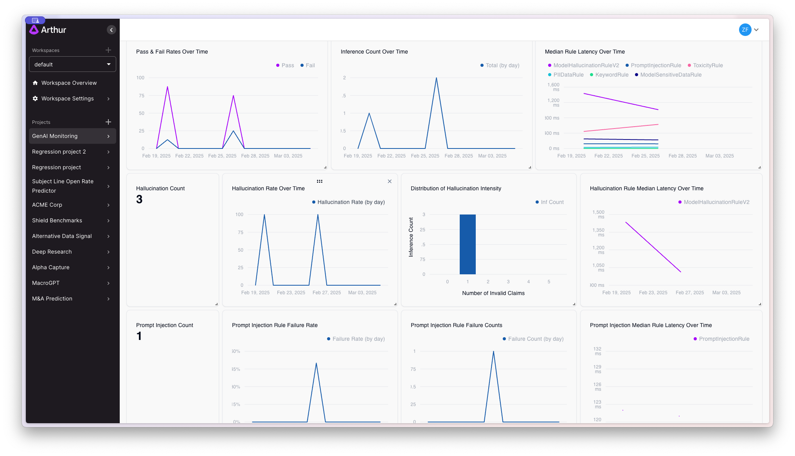

<i>Make AI work for Everyone.</i>

[Website](https://arthur.ai) - [Documentation](https://shield.docs.arthur.ai/docs) - [Talk to someone at Arthur](https://www.arthur.ai/arthur-book-a-demo)

# The Arthur Engine

The Arthur Engine provides a **complete service** for monitoring and governing your AI/ML workloads using popular Open-Source technologies and frameworks. It is a tool designed for:

- **Evaluating and Benchmarking Machine Learning models**
  - Support for a wide range of evaluation metrics (e.g., drift, accuracy, precision, recall, F1, and AUC)
  - Tools for comparing models, exploring feature importance, and identifying areas for optimization
  - For LLMs/GenAI applications, measure and monitor response relevance, hallucination rates, token counts, latency, and more
- **Enforcing guardrails in your LLM Applications and Generative AI Workflows**
  - Configurable metrics for real-time detection of PII or Sensitive Data leakage, Hallucination, Prompt Injection attempts, Toxic language, and other quality metrics
- **Extensibility to fit into your application's architecture**
  - Support for plug-and-play metrics and extensible API so you can bring your own custom-models or popular open-source models (inc. HuggingFace, etc.)

## Quickstart - [See Examples](https://github.com/arthur-ai/engine-examples/)

1. Clone the repository and `cd deployment/docker-compose/genai-engine`
2. Create `.env` file from `.env.template` file and modify it (more instructions can be found in [README](deployment/docker-compose/genai-engine/README.md) on the current path)
3. Run `docker compose up`
4. Wait for the `genai-engine` container to initialize then navigate to localhost:3030/docs to see the API docs
5. [Start building!](genai-engine/README.md#quickstart).

## Arthur Platform Free Version

The `genai-engine` standalone deployment in the Quickstart provides powerful LLM evaluation and guardrailing features. To unlock the full capabilities of the Arthur Platform, [sign up](https://platform.arthur.ai/signup) and get started for free.

## Arthur Platform Enterprise Version

**The enterprise version of the Arthur Platform provides better performance, additional features, and capabilities**, including custom enterprise-ready guardrails + metrics, which can maximize the potential of AI for your organization.

Key features:

- State-of-the-art proprietary evaluation models trained by Arthur's world-class machine learning engineering team
- Airgapped deployment of the Arthur Engine (no dependency to Hugging Face Hub)
- Optional on-premises deployment of the entire Arthur Platform
- Support from the world-class engineering teams at Arthur

To learn more about the enterprise version of the Arthur Platform, [reach out!](https://www.arthur.ai/arthur-book-a-demo)

Performance Comparison between Free vs Enterprise version of Arthur Engine :

Enterprise version of Arthur Engine leverages state-of-the-art high-performing, low latency proprietary models for some of the LLM evaluations. Please see below for a detailed comparison between open-source vs enterprise performance.
| **Evaluation Type**  | **Dataset**                     | **Free Version Performance (f1)** | **Enterprise Performance (f1)** | **Free Version Average Latency per Inference (s)** | **Enterprise Average Latency per Inference (s)** |
|----------------------|--------------------------------|----------------------------------|--------------------------------|-------------------------------------------------|--------------------------------------------------|
| Prompt Injection    | deepset                        | 0.52 (0.44, 0.60)               | 0.89 (0.85, 0.93)              | 0.966                                           | 0.03                                             |
| Prompt Injection    | Arthur’s Custom Benchmark      | 0.79 (0.62, 0.93)               | 0.85 (0.71, 0.96)              | 0.16                                            | 0.005                                            |
| Toxicity           | Arthur’s Custom Benchmark      | 0.633 (0.45, 0.79)              | 0.89 (0.85, 0.93)              | 3.096                                           | 0.0358                                           |

## Overview

The Arthur Engine is built with a focus on transparency and explainability, this framework provides users with comprehensive performance metrics, error analysis, and interpretable results to improve model understanding and outcomes.
With support for plug-and-play metrics and extensible APIs, the Arthur Engine simplifies the process of understanding and optimizing generative AI outputs.
The Arthur Engine can prevent data-security and compliance risks from creating negative or harmful experiences for your users in production or negatively impacting your organization's reputation.

**Key Features:**

- Evaluate models on structured/tabular datasets with customizable metrics
- Evaluate LLMs and generative AI workflows with customizable metrics
- Support building real-time guardrails for LLM applications and agentic workflows
- Trace and monitor model performance over time
- Visualize feature importance and error breakdowns
- Compare multiple models side-by-side
- Extensible APIs for custom metric development or for using custom models
- Integration with popular libraries like LangChain or LlamaIndex (coming soon!)

**LLM Evaluations:**

| Eval                                | Technique                                                                                                         | Source                                                                        | Docs                                                        |
| ----------------------------------- | ----------------------------------------------------------------------------------------------------------------- | ----------------------------------------------------------------------------- | ----------------------------------------------------------- |
| Hallucination                       | Claim-based LLMJudge technique                                                                                    | [Source](genai-engine/src/scorer/checks/hallucination/v2.py)               | [Docs](https://shield.docs.arthur.ai/docs/hallucination)    |
| Prompt Injection                    | Open Source: Using [deberta-v3-base-prompt-injection-v2](https://huggingface.co/protectai/deberta-v3-base-prompt-injection-v2) | [Source](genai-engine/src/scorer/checks/prompt_injection/classifier.py)    | [Docs](https://shield.docs.arthur.ai/docs/prompt-injection) |
| Toxicity                            | Open Source: Using [roberta_toxicity_classifier](https://huggingface.co/s-nlp/roberta_toxicity_classifier)                     | [Source](genai-engine/src/scorer/checks/toxicity/toxicity.py)              | [Docs](https://shield.docs.arthur.ai/docs/toxicity)         |
| Sensitive Data                      | Few-shot optimized LLM Judge technique                                                                             | [Source](genai-engine/src/scorer/checks/sensitive_data/custom_examples.py) | [Docs](https://shield.docs.arthur.ai/docs/sensitive-data)   |
| Personally Identifiable Information | Using [presidio](https://github.com/microsoft/presidio) based off Named-Entity recognition                        | [Source](genai-engine/src/scorer/checks/pii/classifier.py)                 | [Docs](https://shield.docs.arthur.ai/docs/pii-leakage)      |
| CustomRules                         | Extend the service to support whatever monitoring or guardrails are applicable for your use-case                  | Build your own!                                                               | [Docs](https://shield.docs.arthur.ai/docs/custom-rules)     |

_NB: We have provided open-source models for Prompt Injection and Toxicity evaluation as default in the free version of Arthur. In the case that you already have custom solutions for these evaluations and would like to use them, the models used for Prompt Injection and Toxicity are fully customizable and can be substituted out here ([PI Code Pointer](genai-engine/src/scorer/checks/prompt_injection/classifier.py#L20), [Toxicity Code Pointer](genai-engine/src/scorer/checks/toxicity/toxicity.py#L29)). If you are interested in higher performing and/or lower latency evaluations out of the box, please enquire about the enterprise version of Arthur Engine._

## Broad Integration Support Through the OpenInference Specification

Arthur Engine fully supports the OpenInference specification, which allows you to connect the Engine to a wide range of AI frameworks, libraries, and agent stacks without custom instrumentation.

OpenInference provides a shared trace and data schema for AI systems. Since Arthur Engine follows this standard, you can immediately use any integration already built for the OpenInference ecosystem, including the large collection maintained by Arize Phoenix.

This includes support for many popular frameworks such as:

- LangChain  
- LangGraph  
- LlamaIndex  
- Vercel AI SDK  
- FastAPI and Flask apps instrumented with OpenInference  
- OpenAI, Anthropic, Google, and other model providers aligned with the spec  
- Agent frameworks, orchestration tools, and custom pipelines supported by Phoenix integrations  
- And many others

You can view the full and continuously updated list of supported integrations here:  
https://github.com/Arize-ai/phoenix?tab=readme-ov-file#tracing-integrations

By adopting OpenInference, Arthur Engine provides a flexible and future proof way to bring traces, spans, metrics, inputs, outputs, and evaluation signals into the Arthur platform. This makes it easy to collect data from diverse Gen AI apps, agents, and services with a single unified integration path.

## Contributing

- Join the Arthur community on [Discord](https://discord.gg/tdfUAtaVHz) to get help and share your feedback.
- To make a request for a bug fix or a new feature, please file a [Github issue](https://github.com/arthur-ai/arthur-engine/issues).
- For making code contributions, please review the [contributing guidelines](CONTRIBUTE.md).
