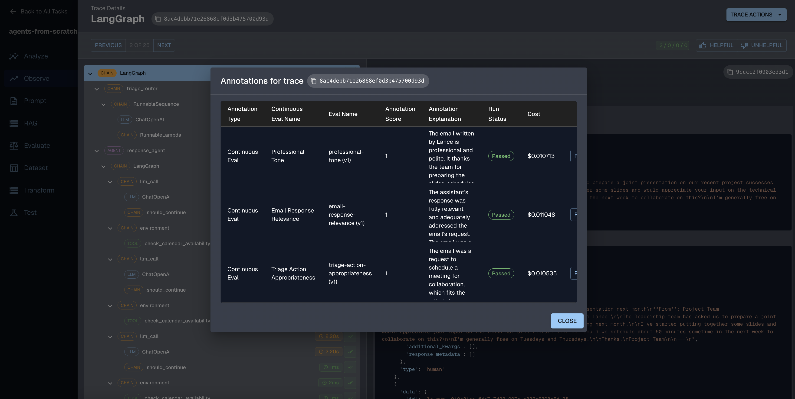
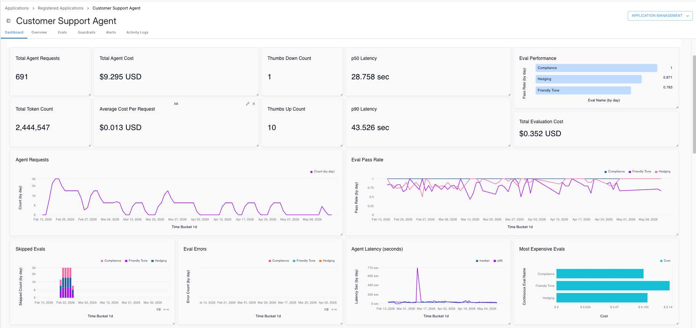

<div align="center">


<i>Make AI work for Everyone.</i>

[](actions?query=workflow%3A%22%22GenAI+Engine+Workflow%22%22++)
[](https://discord.gg/tdfUAtaVHz)

[Website](https://arthur.ai?utm_source=github&utm_medium=readme) - [Documentation](https://docs.arthur.ai/?utm_source=github&utm_medium=readme) - [Talk to someone at Arthur](https://www.arthur.ai/book-demo?utm_source=github&utm_medium=readme)

</div>

# The Arthur Engine

The Arthur Engine provides a **complete service** for developing, monitoring, and governing your AI/ML workloads using popular open-source technologies and frameworks. It is a tool designed for:

- **Enforcing guardrails in your LLM Applications and Generative AI Workflows**
  - Configurable metrics for real-time detection of PII or Sensitive Data leakage, Hallucination, Prompt Injection attempts, Toxic language, and other quality metrics
- **Building, Observing and Governing Agentic Applications**
  - Collect and analyze OpenInference traces from any agentic workflow or LLM application
  - Run continuous evaluations on live traces to catch regressions and quality issues automatically
  - Manage, version, and iterate on prompts across your applications
  - Run experiments to compare prompt variants and measure their impact on quality metrics
  - Evaluate and monitor Retrieval-Augmented Generation (RAG) pipelines end-to-end
- **Evaluating and Benchmarking Machine Learning models (requires the Arthur Platform)**
  - Support for a wide range of evaluation metrics (e.g., drift, accuracy, precision, recall, F1, and AUC)
  - Tools for comparing models, exploring feature importance, and identifying areas for optimization
  - For LLMs/GenAI applications, measure and monitor response relevance, hallucination rates, token counts, latency, and more
- **Extensibility to fit into your application's architecture**
  - Native support for custom metrics and extensible API

## Quickstart

**Claude Code users**
Paste this prompt directly into Claude Code — no installation needed:

```
Fetch https://raw.githubusercontent.com/arthur-ai/arthur-engine/refs/heads/main/integrations/claude-code-skills/arthur-onboard/SKILL.md, save it to ~/.claude/skills/arthur-onboard/SKILL.md (create the directory if it doesn't exist), read the saved file, and follow its instructions.
```

**Everyone else**
Run the engine installer with the below command:

Mac
```
bash <(curl -sSL https://get-genai-engine.arthur.ai/mac)
```

Windows
```
iex (iwr -Uri "https://get-genai-engine.arthur.ai/win" -UseBasicParsing).Content
```

Instrument your agents for evaluations and LLM guardrailing by referencing the examples:

https://github.com/arthur-ai/arthur-engine/tree/dev/genai-engine/examples



## Arthur Platform Free Version

To unlock the full capabilities of the Arthur Platform, [sign up](https://platform.arthur.ai/signup) and get started for free.
* Custom dashboards
* Alerts and notifications
* Configurable webhook that can trigger any workflow
* Agent discovery
* Governance



## Arthur Platform Enterprise Version

**The enterprise version of the Arthur Platform provides better performance, additional features, and capabilities**, including custom enterprise-ready guardrails + metrics, which can maximize the potential of AI for your organization.

Key features:

- State-of-the-art proprietary evaluation models trained by Arthur's world-class machine learning engineering team
- Air-gapped deployment of the Arthur Engine (no dependency to Hugging Face Hub)
- Optional on-premises deployment of the entire Arthur Platform
- Support from the world-class engineering teams at Arthur

To learn more about the enterprise version of the Arthur Platform, [reach out!](https://www.arthur.ai/book-demo)

## Contributing

- Join the Arthur community on [Discord](https://discord.gg/tdfUAtaVHz) to get help and share your feedback.
- To make a request for a bug fix or a new feature, please file a [GitHub issue](https://github.com/arthur-ai/arthur-engine/issues).
- To make code contributions, please review the [contributing guidelines](CONTRIBUTING.md).
- Thank you!
