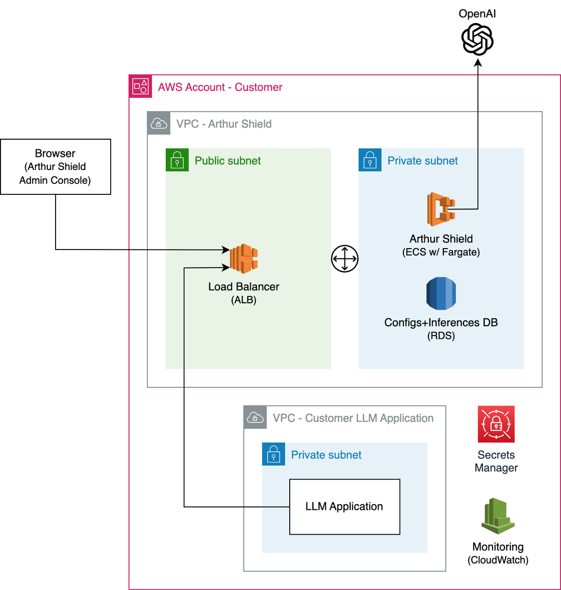

# Arthur Engine AWS CloudFormation Deployment Guide

## Prerequisites

### Engine Version
Look up an engine version to use from the [Releases](https://github.com/arthur-ai/arthur-engine/releases).

### OpenAI GPT Model
Arthur GenAI Engine's hallucination and sensitive data rules require an OpenAI GPT model for running evaluations.
Please review the GPT model requirements below:
* An OpenAI GPT model with at least one endpoint. GenAI Engine supports Azure and OpenAI as the LLM service provider.
* A secure network route between your AWS infrastructure and the OpenAI endpoint(s)
* Token limits, configured appropriately for your use cases

### DNS
A DNS URL for the GenAI Engine with an SSL certificate

### AWS Environment
* AWS credentials for the CloudFormation template install with the permissions to manage IAM, security groups, secrets
in the Secrets Manager, load balancer, RDS, ECS, and CloudWatch (IAM and RDS can use existing)
* A VPC with 3 private subnets and 2-3 public (client-facing) subnets
* An AWS ARN of the TLS certificate for the GenAI Engine application DNS URL created/imported in the AWS Certificate Manager

### Container Image Repository Access
* There must be a network route available to connect to Docker Hub
* If Docker Hub access is not an option, you can push the images from Docker Hub to your private container registry and provide its access information in the Cloudformation template

### Arthur Platform Engine Credentials
To use the free/paid [Arthur Platform](https://platform.arthur.ai), you need to login and get a pair of `Client ID` and `Client Secret`.
If you're not using the Arthur Platform, the Arthur GenAI Engine-only (guardrails) deployment is what you're looking for.

## GPU Deployment
Arthur recommends running the GenAI Engine on GPUs for any production-grade deployments. The usage of GPUs provides significantly lower latency, higher scalability and platform cost efficiency.

## How to install GenAI Engine using AWS CloudFormation template from AWS Console

1. Log in to the AWS account that has the VPC and the subnets you want to deploy to
2. Go to the CloudFormation page on the AWS Console
3. From the "Stacks" page, select "Create stack" -> "With new resources (standard)"
4. Populate the "Create stack" page and click "Next"
   1. Select "Template is ready" and "Amazon S3 URL"
   2. Provide the HTTP link to the CloudFormation template that maps to the latest stable version
      1. Arthur Engine GPU stack deployment: 
      `https://arthur-cft.s3.us-east-2.amazonaws.com/arthur-engine/templates/<version_number>/root-arthur-engine-gpu.yml`
      2. Arthur Engine CPU stack deployment: 
      `https://arthur-cft.s3.us-east-2.amazonaws.com/arthur-engine/templates/<version_number>/root-arthur-engine-cpu.yml`
      3. Arthur GenAI Engine-only (guardrails) GPU stack deployment (): 
      `https://arthur-cft.s3.us-east-2.amazonaws.com/arthur-engine/templates/<version_number>/root-arthur-genai-engine-gpu.yml`
      4. Arthur GenAI Engine-only (guardrails) CPU stack deployment (): 
      `https://arthur-cft.s3.us-east-2.amazonaws.com/arthur-engine/templates/<version_number>/root-arthur-genan-engine-cpu.yml`
5. Populate the "Specify stack details" page and click "Next"
6. Populate the "Configure stack options" page and click "Next"
   1. Behavior on provisioning failure: "Roll back all stack resources" (Do not use `--disable-rollback` if you're using AWS CLI)
   2. Delete newly created resources during a rollback: "Use deletion policy"
7. Submit the "Review and create" page
8. (Skip if you provided Route 53 parameter values) Once the `GenaiEngineLBStack` deployment is complete, create an `A` record that routes the Arthur GenAI Engine service
   ingress DNS URL to the GenAI Engine ALB created by the CloudFormation template

## Architecture

## FAQs
### What are the private and public subnets used for and what are their requirements?

The private subnets are where the application (app) and the database (DB) are deployed. The app and the DB should not
be directly accessible by external clients for best practices. The public subnets should be the entry point to GenAI Engine.
The GenAI Engine app load balancer is deployed in the public subnets and routes the GenAI Engine traffic to the GenAI Engine app
instances in the private subnets. Public subnets do not necessarily but typically have a route to the Internet via an
Internet Gateway (IGW), which can optionally reside behind a Virtual Private Network (VPN). Private subnets do not
have a direct route to the Internet. Instances in a private subnet are accessed via a Network Address Translation(NAT)
gateway in the public gateway. Make sure the proper routes exist between the private and the public subnets. Please
remember that the public subnets do not have to be exposed to the Internet. They are the entry point for the client LLM
applications to talk to GenAI Engine.

Depending on the architecture of your infrastructure, you can choose the same set of subnets for both the private and
the public subnets of a GenAI Engine deployment. Make sure the app and the DB are secured, and they have access to the AWS
Secrets Manager.

### How do I configure my bring-your-own IAM roles?

Please refer to the IAM details described in the CloudFormation template:
* `https://arthur-cft.s3.us-east-2.amazonaws.com/arthur-engine/templates/<version_number>/genai-engine/arthur-genai-engine-iam.yml`
* `https://arthur-cft.s3.us-east-2.amazonaws.com/arthur-engine/templates/<version_number>/ml-engine/arthur-ml-engine-iam.yml`

### How do I configure my bring-your-own security groups?

Please refer to the security group details described in the CloudFormation templates:
* `https://arthur-cft.s3.us-east-2.amazonaws.com/arthur-engine/templates/<version_number>/core/arthur-core-security-groups.yml`
* `https://arthur-cft.s3.us-east-2.amazonaws.com/arthur-engine/templates/<version_number>/genai-engine/arthur-genai-engine-security-groups.yml`
* `https://arthur-cft.s3.us-east-2.amazonaws.com/arthur-engine/templates/<version_number>/ml-engine/arthur-ml-engine-security-groups.yml`

### The usage of my Azure OpenAI endpoint is going beyond my quota. What do I do?

Azure OpenAI has a quota called Tokens-per-Minute (TPM). It limits the number of tokens that a single model can process
within a minute in the region the model is deployed. To get a larger quota for GenAI Engine, you can deploy additional
models in other regions and have Arthur GenAI Engine round-robin against multiple Azure OpenAI endpoints. In addition, you can
request and get approved for a model quota increase in the desired regions by Azure.
