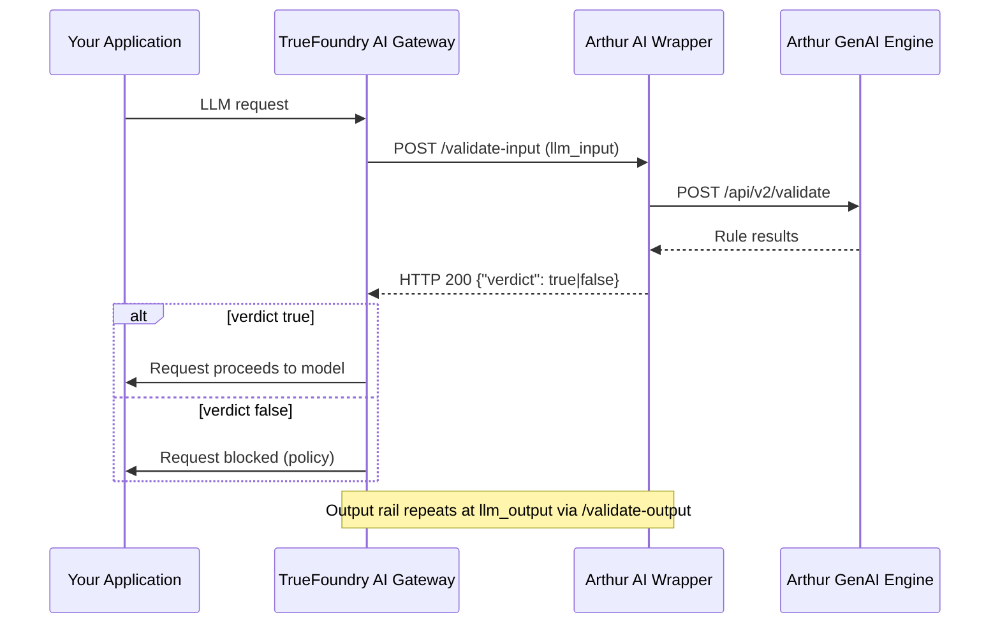
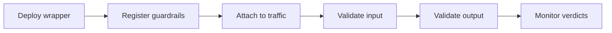

# Arthur + TrueFoundry

How do you run Arthur AI as a custom guardrail on TrueFoundry AI Gateway? Deploy the [`integrations/arthur-ai`](https://github.com/truefoundry/integrations-custom-guardrails/tree/main/integrations/arthur-ai) **FastAPI wrapper** on any **public HTTPS** host, register it as a **Custom Guardrail** in TrueFoundry, and attach the guardrail group to your models or requests. TrueFoundry calls the wrapper at `llm_input` / `llm_output`; the wrapper forwards traffic to [Arthur GenAI Engine](https://engine.platform.arthur.ai) and returns `verdict` JSON on HTTP 200 — validating prompts on the way in and completions on the way out without redacting or rewriting text.

***

## Overview

<a href="https://www.truefoundry.com/ai-gateway" target="_blank" rel="noopener" referrerpolicy="strict-origin-when-cross-origin">TrueFoundry AI Gateway</a> is the proxy layer that sits between your applications and the LLM providers and MCP Servers. It is an enterprise-grade platform that enables users to access 1000+ LLMs using a unified interface while taking care of observability and governance.

Arthur AI integrates with TrueFoundry as a **Custom Guardrail**. When LLM traffic flows through the gateway, Arthur validates prompts on the way in and completions on the way out — reporting pass/block verdicts without redacting or rewriting text. TrueFoundry calls the wrapper via the [Custom Guardrail](https://www.truefoundry.com/docs/ai-gateway/custom-guardrails) contract at `llm_input` / `llm_output`, and the wrapper forwards traffic to [Arthur GenAI Engine](https://engine.platform.arthur.ai) and returns `verdict` JSON on HTTP 200.

Once configured, you get:

* **Input validation** — prompts checked before they reach the model
* **Output validation** — completions checked before they return to your application
* **Pass/block verdicts** — policy outcomes reported without redacting or rewriting text
* **Configurable checks** — default `PromptInjectionRule` + `ToxicityRule` on input and `ToxicityRule` on output when `config` is `{}`



**How it works:**

1. TrueFoundry AI Gateway POSTs an OpenAI-shaped `requestBody` (input) or `requestBody` + `responseBody` (output) to your wrapper URL.
2. The wrapper extracts user/assistant text and calls Arthur with your `ARTHUR_API_KEY`.
3. The wrapper returns **HTTP 200** with a policy outcome in the body. Infrastructure failures return **HTTP 5xx**.

```
Your app ─► TrueFoundry gateway ─► Arthur AI wrapper ─► engine.platform.arthur.ai/api/v2/validate
```

**Prerequisites:**

* **Arthur API key** from the [Arthur platform](https://engine.platform.arthur.ai).
* **Public HTTPS URL** for the deployed wrapper.
* **`WRAPPER_API_KEY`** — shared secret TrueFoundry sends as `Authorization: Bearer …`.

***

## Arthur AI guardrail behavior

[Arthur GenAI Engine](https://engine.platform.arthur.ai) validates LLM prompts and completions. The wrapper calls `POST /api/v2/validate` and maps rule results to pass/block — it does not embed policy logic beyond the checks you configure in Arthur.

Arthur is **validate-only**. On TrueFoundry, use **Operation: Validate** for both input and output rails.

Default checks when `config` is `{}`:

* **Input:** `PromptInjectionRule` + `ToxicityRule`
* **Output:** `ToxicityRule`

> 📘 **Arthur is validate-only.** Use **Operation: Validate** for both input and output rails. Arthur reports failures but does not redact or rewrite text.

***

## Response contract

| HTTP | Body | Meaning |
| ---- | ---- | ------- |
| `200` | `{"verdict": true}` | Allow |
| `200` | `{"verdict": false, "message": "..."}` | Block (policy) |
| `5xx` | error JSON | Wrapper or Arthur failure |

Policy blocks use **2xx + `verdict: false`**, not HTTP 4xx. See [Custom guardrail response contract](https://www.truefoundry.com/docs/ai-gateway/custom-guardrails#custom-guardrail-response-contract).

***

## Wrapper endpoints

| Path | Target |
| ---- | ------ |
| `/validate-input` | Request (input) |
| `/validate-output` | Response (output) |

`GET /health` — health check. `GET /debug/loaded-config` — bearer-gated diagnostics.

All POST routes expect `Authorization: Bearer <WRAPPER_API_KEY>`.

***

## Setup

### Clone and configure

```bash Shell
git clone https://github.com/truefoundry/integrations-custom-guardrails
cd integrations-custom-guardrails/integrations/arthur-ai
cp .env.example .env
```

```env Environment
ARTHUR_API_KEY=<from https://engine.platform.arthur.ai>
WRAPPER_API_KEY=<generate: python -c "import secrets; print(secrets.token_urlsafe(32))">
```

> ⚠️ **Use environment variables or secrets for API keys.** Set `ARTHUR_API_KEY` and `WRAPPER_API_KEY` in `.env` or TrueFoundry **Platform → Secrets** rather than committing them to source control.

### Deploy the wrapper

**TrueFoundry:**

```bash Shell
pip install -U truefoundry
tfy login
python deploy.py --wait
```

Set `TFY_WORKSPACE_FQN`, `TFY_PUBLIC_HOST`, `TFY_PUBLIC_PATH`, and secret FQNs in `.env`. Create secrets `arthur-api-key` and `wrapper-api-key` under group `arthur-guardrails-tfy` in **Platform → Secrets**.

**Local:**

```bash Shell
python3 -m venv .venv
.venv/bin/pip install -r requirements-dev.txt
.venv/bin/uvicorn main:app --reload --port 8000
```

### Register Arthur AI guardrail configs in TrueFoundry

**AI Gateway → Guardrails → + Add New Guardrails Group** → type **Custom**.

* **Group name**: `arthur-ai`
* Add two configs — input and output.

**Input validate** example:

| Field | Value |
| ----- | ----- |
| **Name** | `arthur-input-validate` |
| **Operation** | Validate |
| **Target** | Request |
| **Enforcing Strategy** | Enforce But Ignore On Error |
| **URL** | `https://<host>/validate-input` |
| **Headers** | `Authorization` → `Bearer <WRAPPER_API_KEY>`; `Content-Type` → `application/json` |
| **Config** | `{}` |

<Image align="center" caption="Arthur AI guardrail configuration in TrueFoundry (input validate)" src="../images/truefoundry-testing.avif" />

**Output validate:**

| Field | Value |
| ----- | ----- |
| **Name** | `arthur-output-validate` |
| **Operation** | Validate |
| **Target** | Response |
| **URL** | `https://<host>/validate-output` |

**Auth Data → Custom Bearer Auth** works the same as **Headers** if you prefer not to set headers manually.

### Attach Arthur AI guardrails to traffic

**Model pin**: **AI Gateway → Models → `<model>` → Guardrails** → attach group `arthur-ai`.

**Per request** — `X-TFY-GUARDRAILS` header, selector format `<group>/<config-name>`:

```json JSON
{
  "llm_input_guardrails": ["arthur-ai/arthur-input-validate"],
  "llm_output_guardrails": ["arthur-ai/arthur-output-validate"]
}
```

***

## Custom config (optional)

Override default Arthur checks by setting `config.checks` in the TrueFoundry dashboard:

```json JSON
{
  "checks": [
    {"name": "prompt-injection-check", "type": "PromptInjectionRule", "apply_to_prompt": true, "apply_to_response": false},
    {"name": "toxicity-check", "type": "ToxicityRule", "apply_to_prompt": true, "apply_to_response": false, "config": {"threshold": 0.5}}
  ],
  "fail_closed_on_unavailable": false
}
```

| Key | Purpose |
| --- | ------- |
| `credentials.apiKey` | Override `ARTHUR_API_KEY` env var |
| `api_base` | Override Arthur API host (default `https://engine.platform.arthur.ai`) |
| `timeout` | Request timeout in seconds (default 30) |
| `context` / `grounding_context` | Grounding text for hallucination checks |
| `fail_closed_on_unavailable` | Block when Arthur returns Skipped/Unavailable (default `false`) |

***

## Troubleshooting

| Symptom | Likely cause |
| ------- | ------------ |
| `401` from wrapper | `WRAPPER_API_KEY` on the service does not match the dashboard Bearer token |
| Gateway allows despite `verdict: false` | Tenant gateway not honoring verdict-on-200; set **Enforce** or upgrade gateway |
| Arthur Skipped/Unavailable but traffic allowed | Default behavior; set `fail_closed_on_unavailable: true` in config |
| Wrong checks running | Curl `/debug/loaded-config` with Bearer auth to inspect loaded config |

***

## Reference

| Item | Value |
| ---- | ----- |
| Source repo | [`truefoundry/integrations-custom-guardrails/integrations/arthur-ai`](https://github.com/truefoundry/integrations-custom-guardrails/tree/main/integrations/arthur-ai) |
| Arthur Engine | [engine.platform.arthur.ai](https://engine.platform.arthur.ai) |
| Arthur API | `POST https://engine.platform.arthur.ai/api/v2/validate` |
| Selector | `arthur-ai/<config-name>` |
| TrueFoundry docs | [Custom Guardrails](https://www.truefoundry.com/docs/ai-gateway/custom-guardrails) |
| Documentation index | [truefoundry.com/llms.txt](https://www.truefoundry.com/llms.txt) |

***

## Next Steps

Now that Arthur AI is running as a guardrail on TrueFoundry AI Gateway, explore these resources:

* **[Custom Guardrails](https://www.truefoundry.com/docs/ai-gateway/custom-guardrails)** — full TrueFoundry custom guardrail contract and response semantics
* **[Arthur GenAI Engine](https://engine.platform.arthur.ai)** — configure validation rules and review outcomes
* **[Source repo](https://github.com/truefoundry/integrations-custom-guardrails/tree/main/integrations/arthur-ai)** — FastAPI wrapper source, deploy scripts, and `.env` reference
* **[truefoundry.com/llms.txt](https://www.truefoundry.com/llms.txt)** — TrueFoundry documentation index


