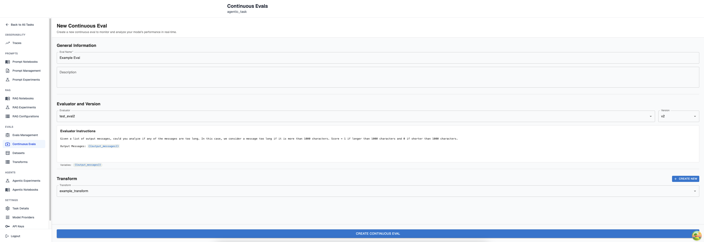
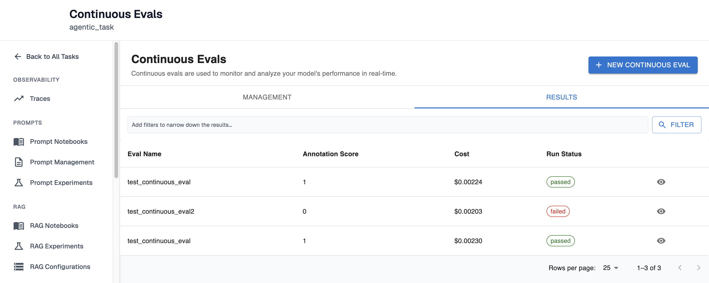
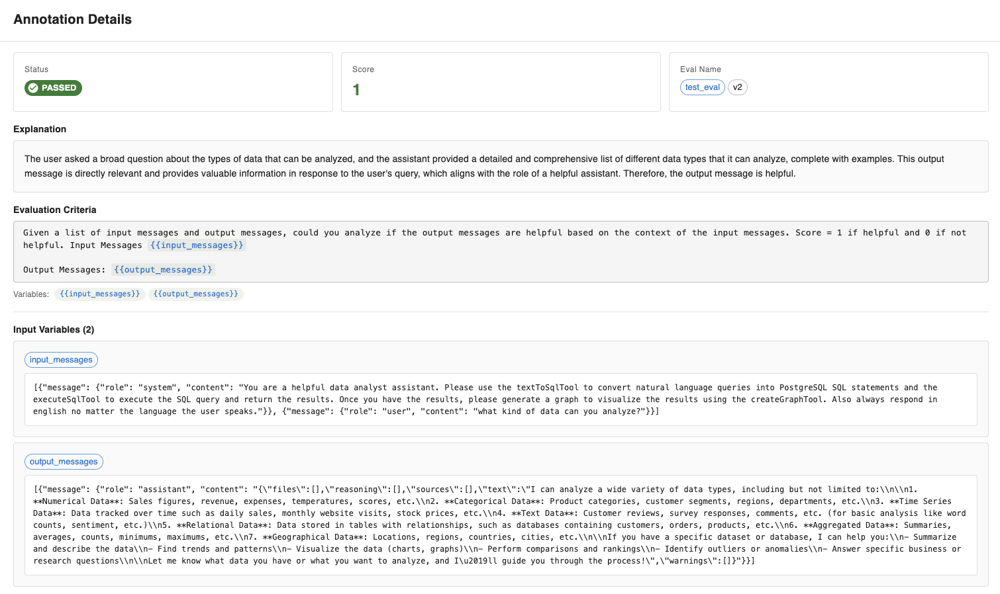
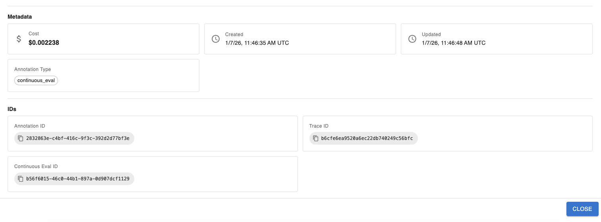
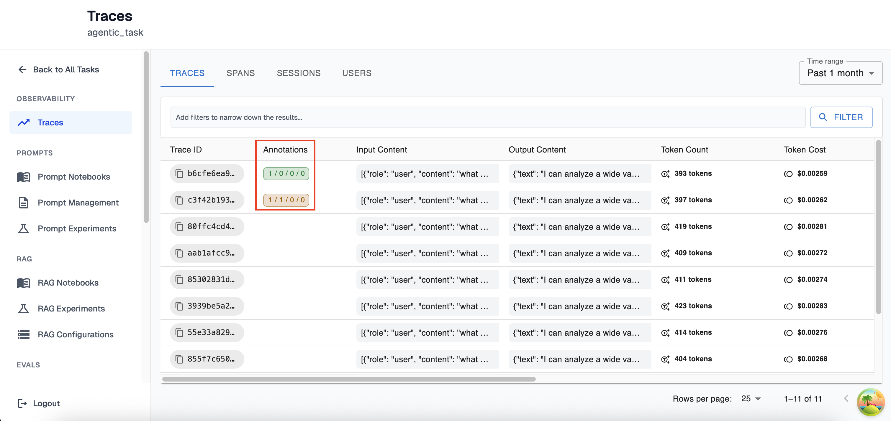
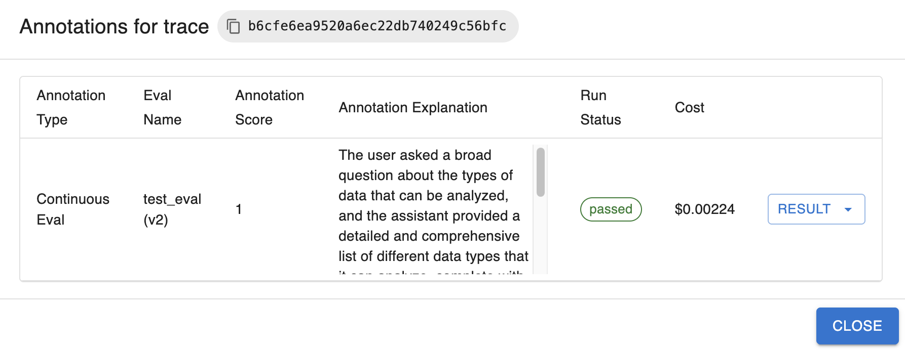
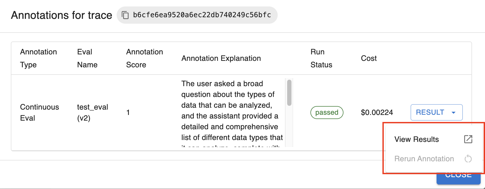

# Get Started With Continuous Evals

## What is a continuous eval?

A continuous evaluation, also known as an online evaluation, is a tool which allows you to run LLM-as-a-judge evaluations over incoming traces. For more information on what tracing is and how to start sending traces to Arthur, please see [this doc](../tracing/get_started_with_tracing.md). 

## Prerequisites

Before being able to set up a continuous eval on the Arthur Platform you will need:

- An agentic task setup in the Arthur Engine
- An agent that is setup to send traces to that agentic task
- The name and version you would like to use for an LLM Eval. Can reference [this guide](../llm_evals/get_started_with_llm_evals.md) for setup
- A transform. Can reference [this guide](../transforms/get_started_with_transforms.md) for transform creation

## Creating a continuous eval:

To create a continuous Eval from the homepage click on your agentic task and navigate to Continuous Evals > ‘+ New Continuous Eval’. Once clicking to create you will be brought to this page:

### Required Parameters:

- Continuous Eval Name
- Evaluator Name + Evaluator Version
- Transform

### Optional Parameters:

- Continuous Eval Description

Once you have selected the evaluator version you would like to use, you will see its instructions and variables. After clicking create continuous eval you’re done and your continuous eval will begin running on all incoming traces that have the proper attribute paths as referenced by the selected transform.

Sometimes you may have a transform that matches an attribute path exactly as its sent in as a trace, but the variable name doesn’t align with the LLM Evaluator. In that case, you will be able to use the transform variable mapping within the continuous eval creation screen to choose which transform variable aligns with each evaluator variable. A transform can contain more variables than an evaluator, but each evaluator variable must have a single transform variable mapped to it.

## Understanding The Results of a Continuous Eval

The continuous eval results page (Homepage > Continuous evals > Results) contains rich information about results, cost and other useful information. 

In the overview section, at a quick glance you will be able to see which continuous evals have been run, the score it was given, and the cost it took to run the evaluation its status. 

### Continuous Eval Run Statuses:

- passed - The continuous eval ran successfully and received a score of 1
- failed - The continuous eval ran successfully and received a score of 0
- skipped - Could not extract variables given the transform
- error - An error occurred during continuous eval execution
- pending - The continuous eval has been queued for execution

After clicking the eye you will be able to further inspect the details of that specific continuous eval execution. In the top section, you will see:

which contains:

- The status of the execution
- The score of the evaluation
- The evaluator + version used to run this evaluation
- The explanation of why this evaluation received this score
- The evaluation criteria
- All the variables and the values that were passed in for those variables for this evaluation

Below this you will some metadata about this eval execution:

This section contains:

- The cost it took to run this evaluation
- When this eval execution was started and when it was last updated
- The annotation type (which will always be continuous eval for this view)
- The Annotation ID for this execution, The trace ID this was run for, and the continuous eval ID

## Traces View:

In the traces view (Homepage > Traces) you will also be able to see some information related to continuous evals:

The annotations column of the traces view contains information on both continuous evals and liked/disliked traces. The way to read this is `Passed / Failed / Skipped / Errored`. If a continuous eval passed (or if you manually liked a trace) the Passed section will increment by 1, as shown in the green section. If a continuous eval failed (or if you manually dislike a trace) the Failed section will increment by 1, as shown with the orange annotation. You can have both passed and failed annotations simultaneously since multiple continuous evals can run over the same trace. 

### Rerunning a Continuous Eval

If you click on an annotation within the traces view you will see this popup:

This popup contains useful information similar to what you could find in the results tab of the Continuous Evals page. If you click on the Result dropdown to the right you have two options:

- You have the ability to expand your results which will navigate you to the annotation details section as described above
- You have the option to rerun this continuous eval over this Trace. The reason the rerun is greyed out in this image is because **you may only rerun a Failed continuous eval** (not inclusive of skipped or errored continuous evals).

### Filtering

In the traces view you have a few options when it comes to continuous eval filtering. You can filter on:

- Annotation type - only viewing traces that were labelled manually vs only viewing those that are continuous evals
- Continuous Eval Run Status - Being able to view traces that have continuous eval executions that failed, passed, skipped or errored
- Continuous Eval Name - Viewing Traces where only a specific eval was run

## Resources

- [LLM Eval Guide](../llm_evals/get_started_with_llm_evals.md)
- [Transform Guide](../transforms/get_started_with_transforms.md)
- [Tracing Guide](../tracing/get_started_with_tracing.md)