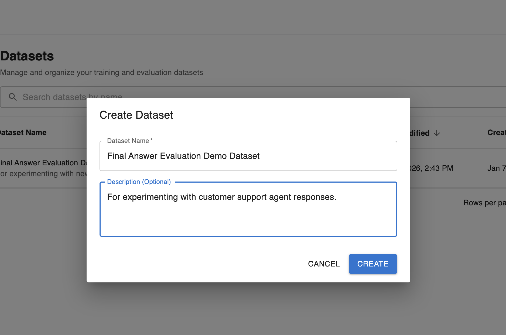
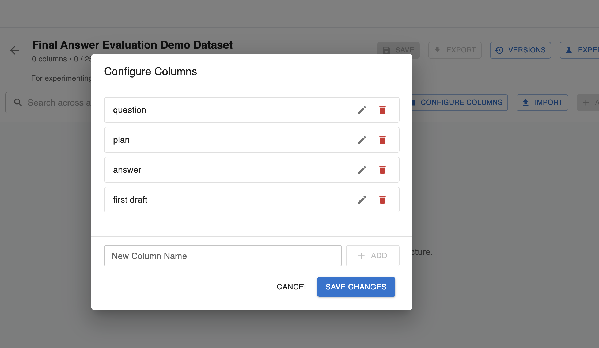
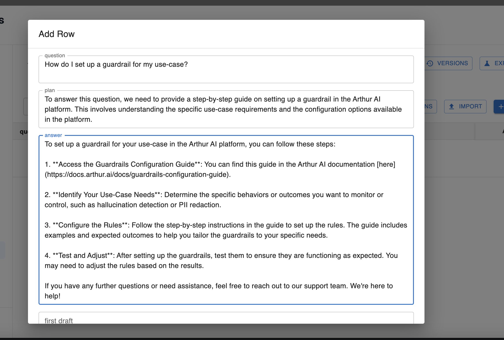
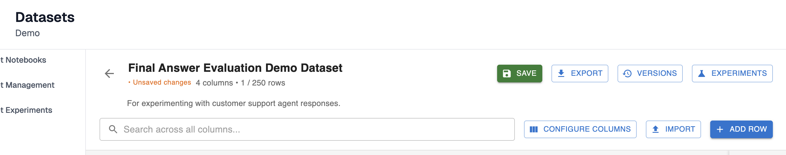
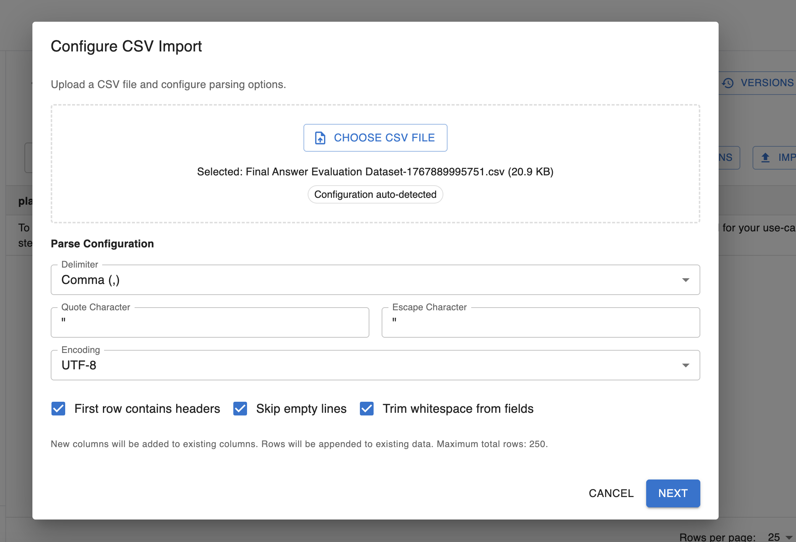
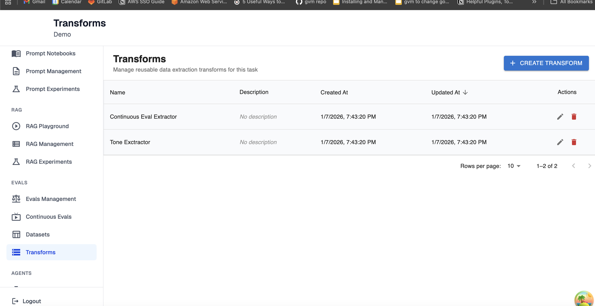
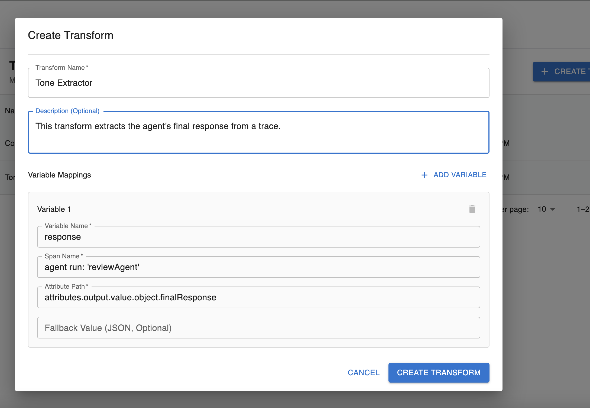
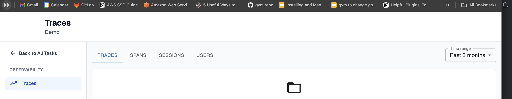
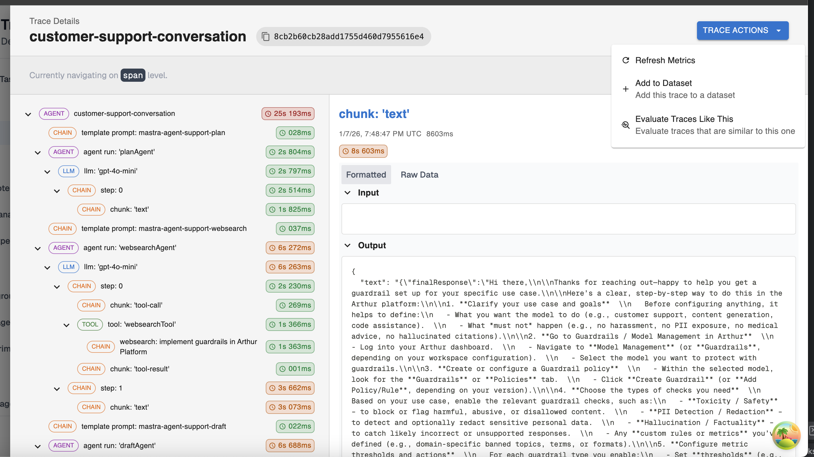
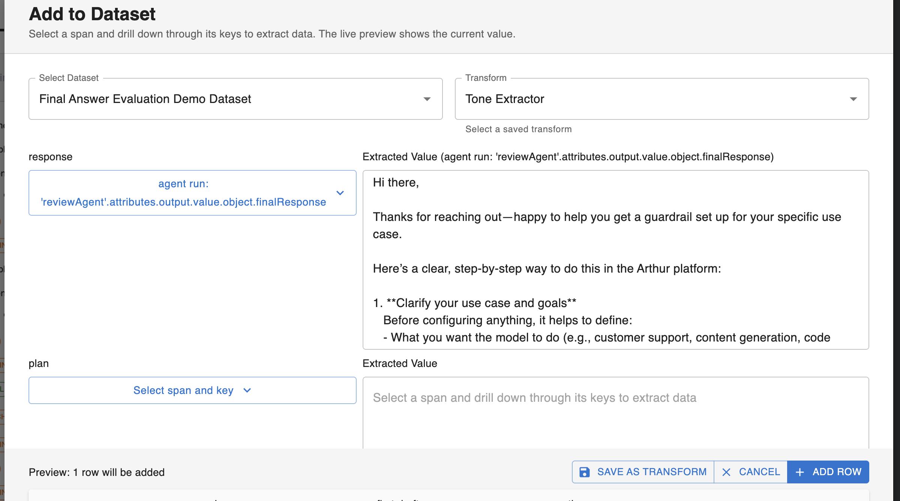

# Offline Evaluation Guide: Creating a Dataset

## Basic Overview

In the Arthur platform, a dataset is a known test set of agent prompts and expected responses used to evaluate actual agent behavior. It can include any arbitrary column/row data of interest to your agent. The dataset can either be created manually from your known set of prompts of interest and importance to your agent, or extracted from actual agent responses using Arthur transforms.

<aside>

Arthur datasets are versioned. For every bulk update (eg. adding a new column, deleting/updating/creating rows) that you make to your dataset, Arthur will create a new version of your dataset. This enables you to evolve your test set over time while still being able to correlate old Arthur experiment runs with the versions of the dataset they were executed over.

</aside>

Throughout this guide, we’ll use an Arthur customer support agent to show you the different ways to create a dataset in Arthur.

<aside>

Arthur datasets allow a maximum of 250 rows per dataset. These datasets are meant to be small test sets of known prompts and responses.

</aside>

## Option 1: Create a dataset manually

In this scenario, you know what rows and columns are of interest to your agent and want to create the test set manually—the dataset doesn’t exist externally yet and you’re creating it for the first time in Arthur.

### Step 1: Create the dataset

Configure a name and description for your test dataset:

### Step 2: Configure columns for your dataset

These columns will be initially populated with empty values. If rows already exist in your dataset and you’re adding a new column, the column will be empty for all existing rows.

### Step 3: Populate row data

Next, start adding rows to your dataset. You can fill out values for every column, or leave some blank.

### Step 4: Submit

When you’re ready to make your bulk update to your dataset and create a new version with your changes, make sure you save your changes! At this point, your dataset is ready for use in Arthur experiments. 

<aside>

See the versions button in the top right to view your dataset history or the export button to export your test set as a CSV.

</aside>

## Option 2: Create a dataset by CSV upload

In this scenario, you already have a test set external to Arthur in a CSV format with the rows you want to populate your dataset with. Click the import button in the top right of your screen and configure the settings:

In this import step, you can configure the delimiter that differentiates between columns in the CSV, quote or escape characters, and the file encoding, along with other settings.

<aside>

This import functions as an append to your existing dataset. New columns are added to existing columns, and rows are appended to existing data: nothing in your existing test set will be overwritten in this set. For any new columns, your existing rows will have empty values.

</aside>

Make sure you save your changes after successful import! At this point, your dataset is ready for use in Arthur experiments. 

## Option 3: Populate a dataset from a trace

In this scenario, a request was made to your agent that you identified as being of interest and want to add to your test set. You can use Arthur transforms to extract the information of interest from the generated trace and populate your dataset with this information:

### Step 1: Create an Arthur Transform

An Arthur transform automates mapping a trace to a set of variables output by the transform with data extracted from the trace. For example, a transform can be configured to extract the final response of the agent from a single trace. To find this feature, look for `Transforms` in the navigation tab:

The important work in a transform is done in the `Variable Mappings` section. Here, you configure the mapping for where you expect the information of interest to you lives in the trace. 

For example, to extract the response from the `reviewAgent` , you would configure the name of the span generated by the agent’s response and the path to the final response from the agent.

The variable name is the output of the transform: this is how you will reference the data it extracts for inclusion in a dataset or experiment step.

<aside>

The easiest way to figure out these variable mappings for the first time is to look at an example trace for your agent and find the data you’re interested in extracting. Then configure the path to this data in a transform to automate this process in the future.

</aside>

### Step 2: Extract data from a trace into a dataset using an Arthur transform.

In this step, you use your previously created transform on the trace you want to add to your dataset. You’ll do this from the trace viewer in the Arthur UI:

From this trace viewer, click into a single trace. Among the trace actions, you can add this trace to a dataset using your transform:

When you select the transform, the rows will be auto-populated so that any columns with matching names to any of the transform output variables will include the extracted data from the test. You also have the option of configuring new manual extractions to extract additional data from your trace:

<aside>

If you add new manual extractions, you can save these extractions as a new transform so you don’t have to repeat this work in the future.

</aside>

At this point, your trace has been added to your dataset! You’re ready to add more data or use your dataset to run Arthur experiments.