# Get Started With LLM Evals

## What is an LLM Evaluator?

An LLM Evaluator is a powerful tool which allows you to create an LLM-as-a-judge that can be utilized to run over Agentic, RAG and Prompt Experiments as well as in Continuous Evals.

## Prerequisites

To get started with creating an LLM evaluator you will need:

1. An agentic task setup in the Arthur Engine
2. Access to an external LLM

## Creating an LLM Evaluator

1. Navigate to the Evals Management Page and select ‘+ New Evaluator’
    1. Select the **agentic** task you would like to set create the evaluator for 
        
        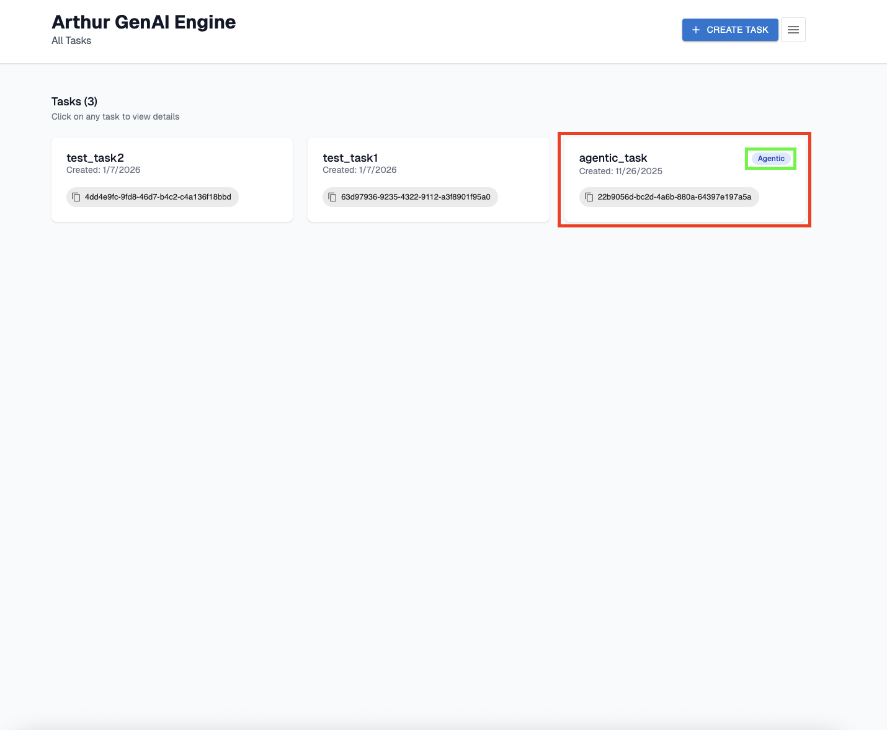
        
    2. Select the evals management page:
        
        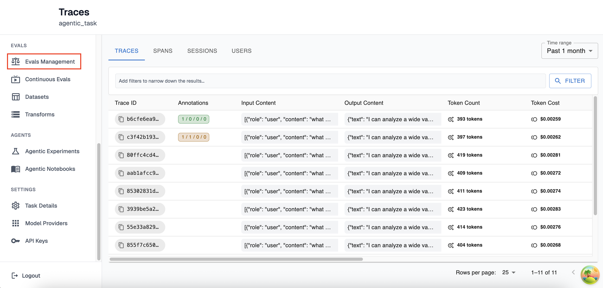
        
    3. Select the ‘+ New Evaluator’ button
        
        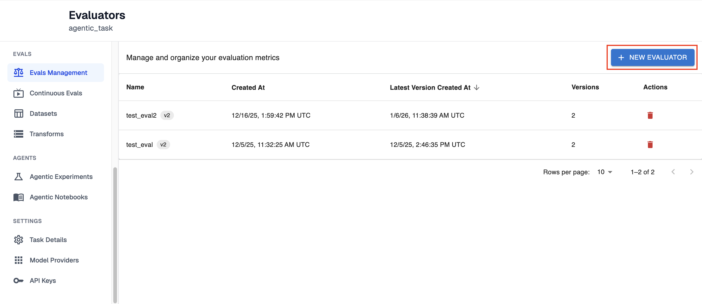
        
2. Create the LLM Evaluator 
    1. Create a new llm eval by giving it a new name, or select from pre-existing evals
        
        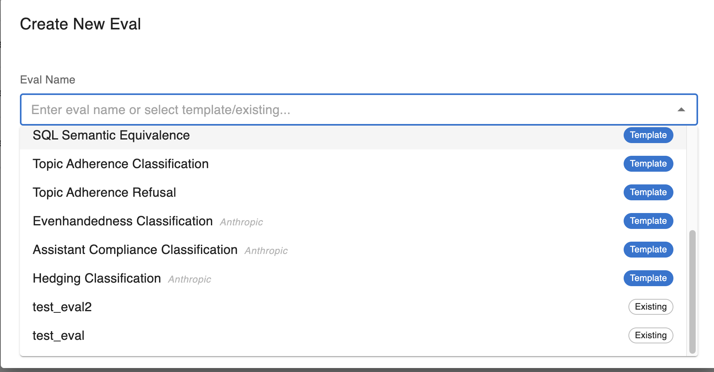
        
    2. Give your own instructions or use the pre-existing instructions (further discussion on prompting your llm evaluator below)
        
        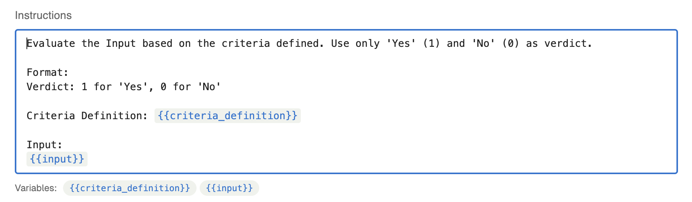
        
    3. Select the LLM provider and model you would like to run your tests over
        
        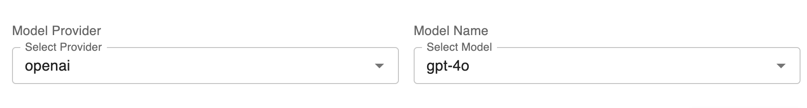
        
    4. Save the new llm evaluator
        
        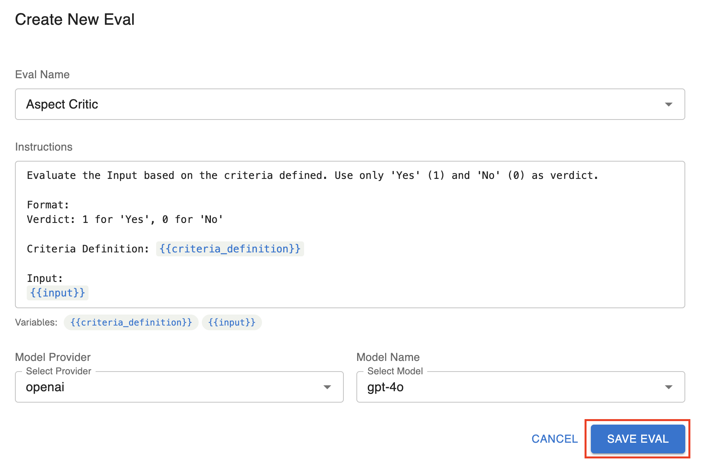
        
    5. If successfully created, you should see the new evaluator in the evals management page 
        
        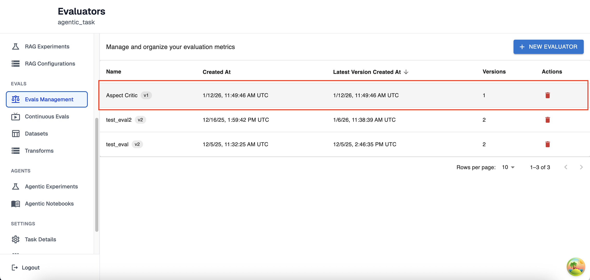
        

## Managing LLM Evaluator Versions

Working an evaluator to run experiments and traces over can be an iterative process. In order to support your ability to continuously improve your LLM evaluators, each time you update an evaluator you will be creating a new version. This way you will be able to switch between different iterations and select which evaluator you prefer to use for production. All subsections of this section will be in the LLM Eval Versions page which you can reach by clicking the evaluator you would like to view from the Evals Management page.

### Creating a new LLM Eval Version

1. To create a new LLM Eval Version, first click edit on the top right of the versions page
    
    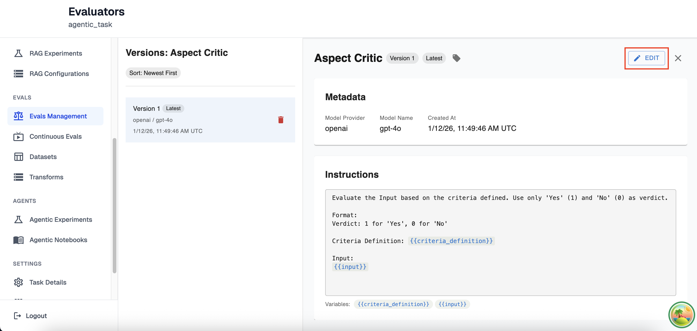
    
2. Here you will be able to modify every aspect of your llm eval exactly like creating a new eval, except you will not be able to change the name of your created evaluator.
    
    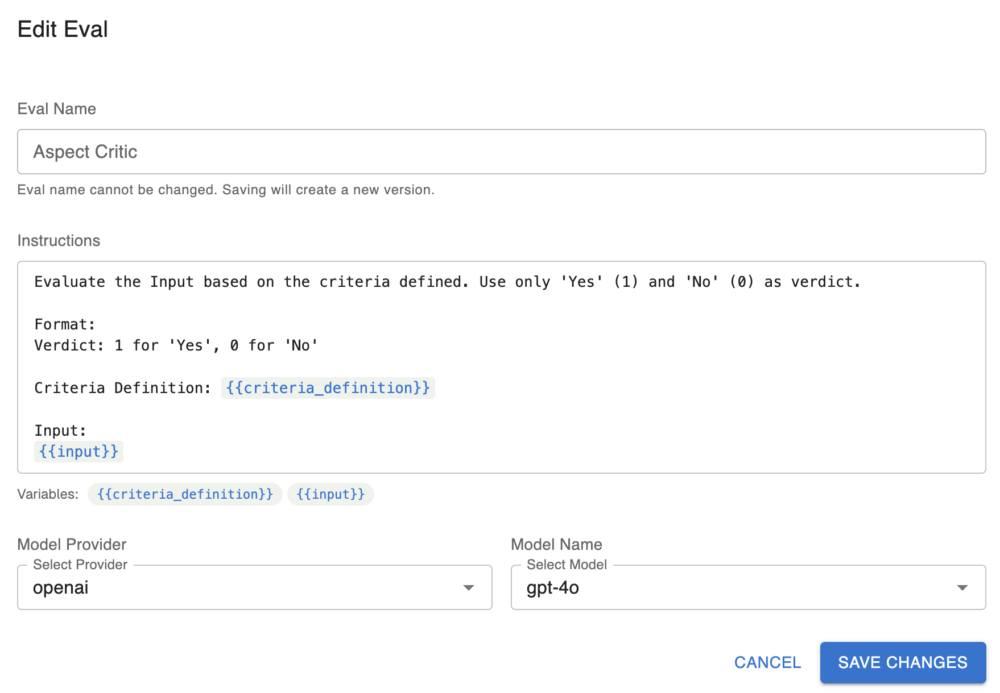
    
3. Once you have updated your LLM Evaluator, you will see the new version on the left-hand side now tagged with the tag ‘latest’ since it’s the most recently created version. On the right-hand side you the instructions, model information and any tags you have set for this new version

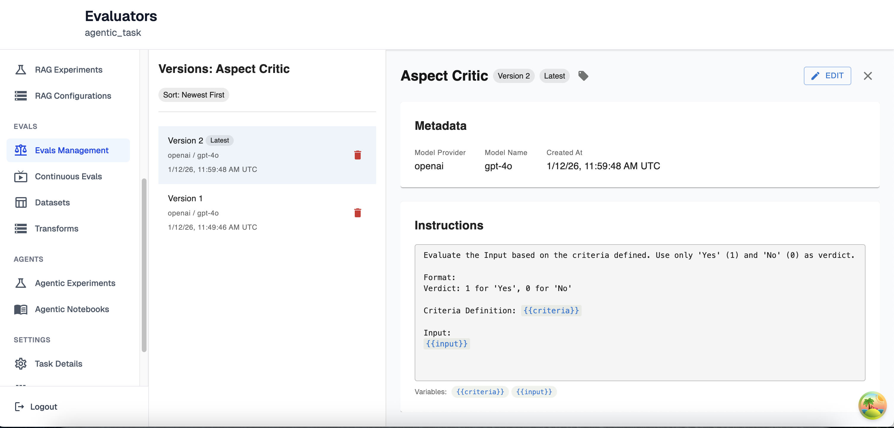

### Deleting LLM Eval Versions

You may delete any version of your LLM Evaluator. However, this change is permanent and you will no longer be able to access any information about your LLM Evaluator apart from when it was created, deleted, the version number and the model provider you were using. An example of a deleted LLM Eval version can be found below

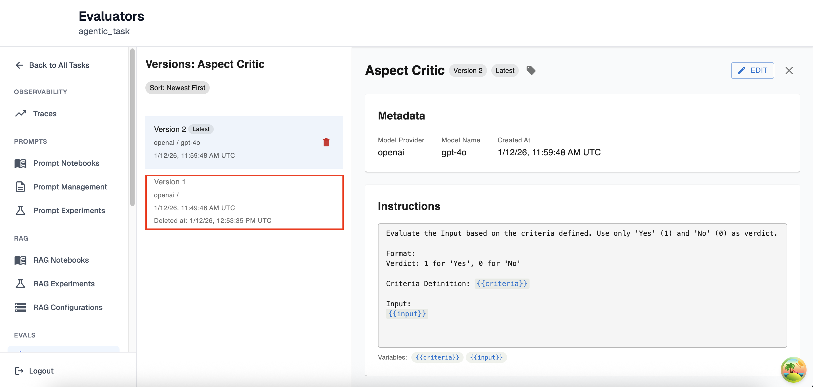

### Tagging LLM Eval Versions

For easier navigation, you have the ability to tag any LLM Eval version with a friendly name to reference it by. This label can be anything except for the tag ‘latest’ as that is reserved for the most recently created LLM Eval. You may add as many tags as you would like to an LLM eval version. To add a tag just click on the tag button and follow the instructions in the drop down like so:

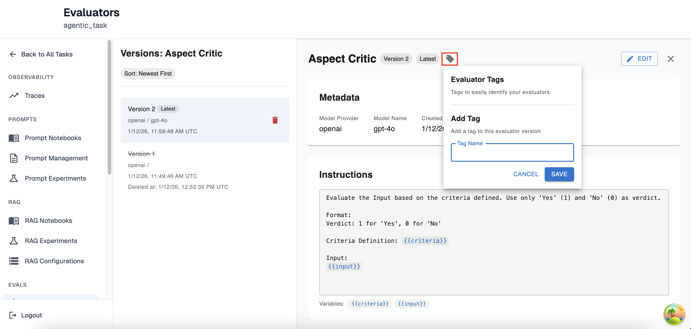

Once a tag is set you will be able to view it in the left-hand side as well as that version’s full view:

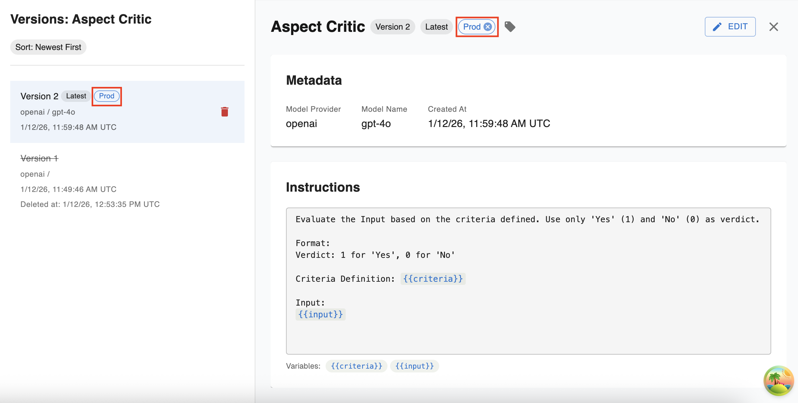

## Prompting Your LLM Evaluator

The instructions you provide your LLM Evaluator will determine the use-case it is meant for and it is important to understand how these Evaluations are run in order to utilize this feature to its full extent. 

### Evaluation Scoring

**Every LLM Evaluator will run its evaluation using a binary evaluator.** That means that regardless of if you tell the evaluator to rank something from ‘1-10’ or you tell it to determine if something is ‘True’ or ‘False’ it will still only return a binary score of 0 or 1. Given that, for the best results you should provide your LLM Evaluator with instructions that have a pass/fail outcome that is easy to describe. For example:

Bad Prompting:

```
Compare a generated SQL query that was returned from an agent to a Reference 
Query. Determine how close the output query is to being semantically equivalent
to the reference query on a scale of 1-10, with 1 being completely different 
and 10 being semantically identical.

Generated Query: {{generated_query}}

Reference Query: {{reference_query}}
```

Good Prompting:

```
Compare a generated SQL query that was returned from an agent to a Reference 
Query. Determine how close the output query is to being semantically equivalent
to the reference query. Give a score of 0 if the generated query is completely
different and 1 if it semantically equivalent to the reference.

Generated Query: {{generated_query}}

Reference Query: {{reference_query}}
```

### Instruction Variables

Instruction variables are how you provide your LLM Evaluator with the information you would like to be evaluated. For instance, in the examples above the two variables are `generated_query` and `reference_query`. 
** Note: Configuring how a resource maps to each variable is experiment dependent, so please refer to the documentation for the type of experiment/eval you are trying to create for further information*

- **Variable formatting:**
    - Variables are created in the instruction field of the LLM Evaluator using **mustache formatting (double curly brackets on either end of the text).** For example, the text    `{{ example_variable }}` would allow you to set the variable example_variable across experiments. You can find more information on mustache formatting [here](https://mustache.github.io/mustache.5.html)
    - Arthur also supports [jinja conditionals](https://jinja.palletsprojects.com/en/stable/templates/) as valid variable formats. For example, let’s say you have a boolean variable `is_admin` that you would like to use to help determine if a response should be ‘Hello Admin’ or just ‘Hello’. You could set the variable as:
        
        `Hello AdminHello`
        

## Next steps

[Prompt Experiments User Guide](../prompts/prompt_experiments_user_guide.md)

[Get Started With Continuous Evals](../continuous_evals/get_started_with_continuous_evals.md)

[Get Started With Transforms](../transforms/get_started_with_transforms.md)

## Resources

- [Mustache formatting for Variables](https://mustache.github.io/mustache.5.html)
- [Creating Jinja Conditionals](https://jinja.palletsprojects.com/en/stable/templates/)