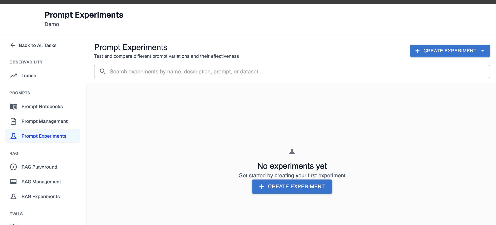
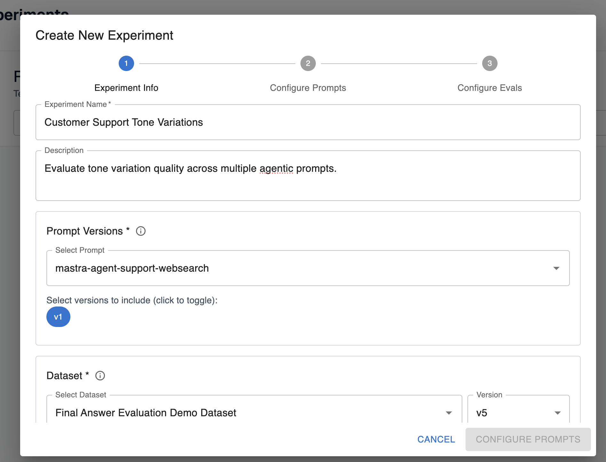
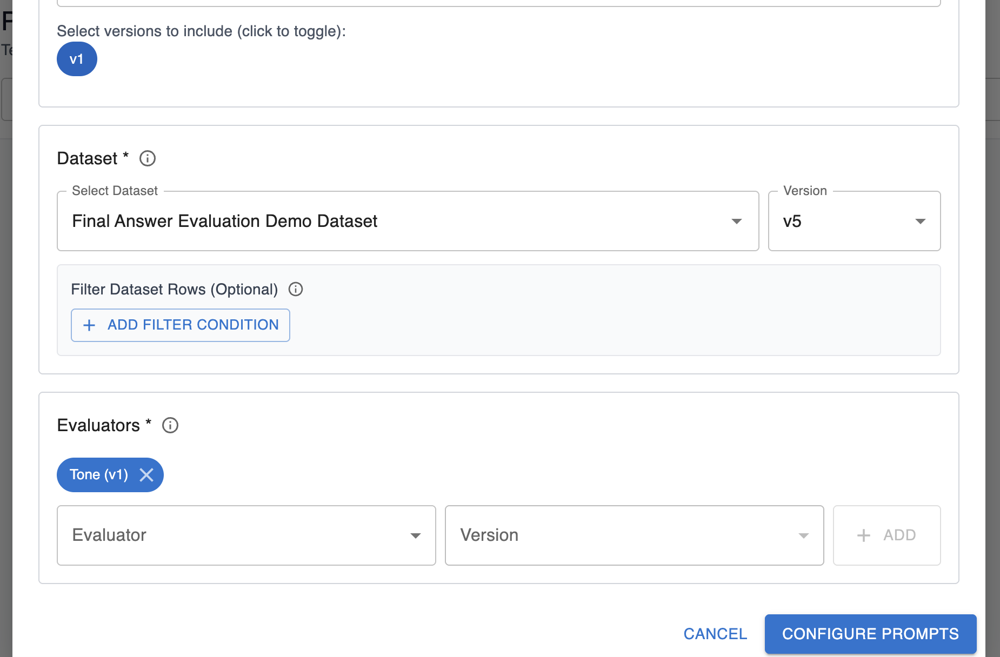
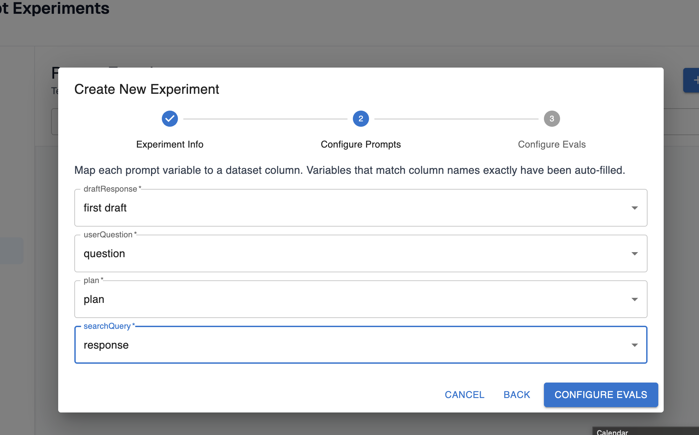
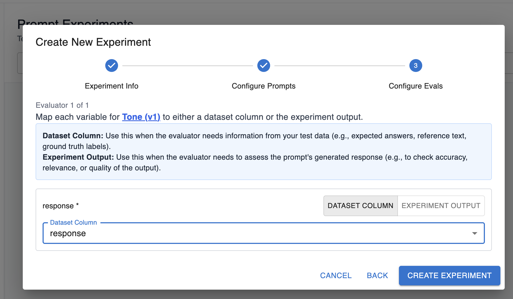
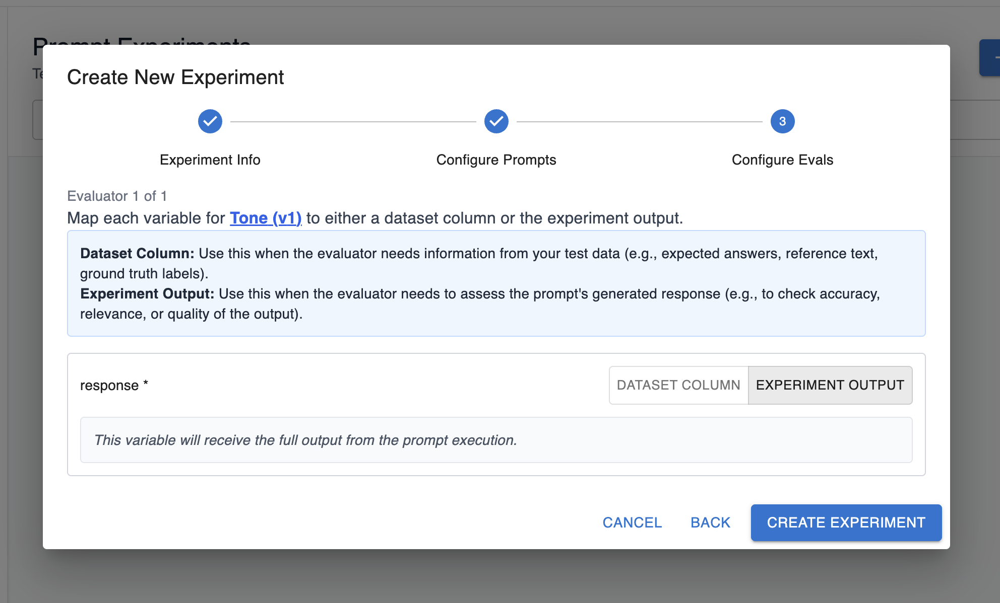
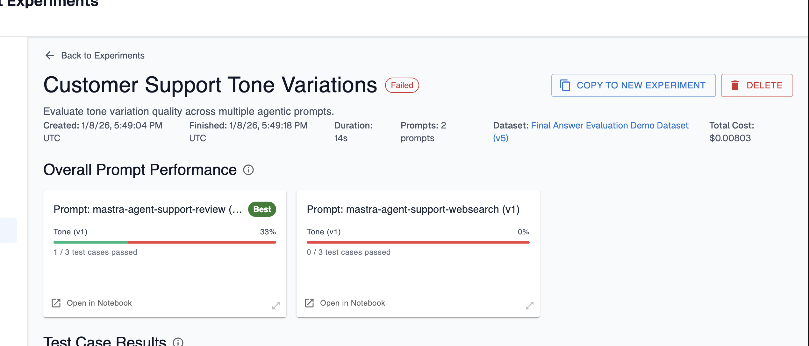

# Offline Evaluation Guide: Running a Prompt Experiment

## Overview

Arthur prompt experiments enable testing and comparing the effectiveness of different prompt variations for a single agent. Using Arthur datasets and evals, you can run known prompts and evaluate the agent’s response against your ideal response.

<aside>

This guide assumes you’ve already created prompt templates and evals for your experiment. If you haven’t done that yet, please refer to the guides for working with prompts and evals.

</aside>

## FAQ: What Happens When I Run a Prompt Experiment?

Here’s an overview of what prompt experiments are doing step-by-step:

We’ll execute a “Prompt Experiment Test Case” for every individual row in the dataset you configure for the experiment. We’ll populate the request we make to your agent with the columns you configure for the experiment. Once we get a response from your agent, we’ll run this response through your configured evaluations.

At this point, you can see the outcome of your test cases—whether each eval marked the response as passed or failed, the total cost of executing the evals over your test cases, and more. You can compare these outcomes between prompts to figure out which prompts work best for the scenarios that are most important to your agent.

## How To Create a Prompt Experiment

### Step 1: Navigate to the Prompt Experiments Page.

### Step 2: Basic experiment configuration

Description of fields on this configuration:

1. Name: Friendly name of the experiment for your reference in the UI.
2. Description: Description of what the experiment is testing.
3. Prompt and versions: Select the prompts and versions you want to test in your experiment. You can configure multiple versions of the same prompt for your experiment run.
4. Dataset: Pick the dataset and version you want to run through the agent. You can add optional filters to only execute the experiment over a subset of rows in a dataset.
5. Evaluators: Pick the evals you want to evaluate over the agent’s response. These evals should measure the behavior you’re interested in testing for the different prompts.

### Step 3: Configure the prompts

Your prompt template likely has some templated variables configured that need to be filled out. For prompt experiments, you should map these variables to the columns in your dataset that hold the values these variables should be filled with:

### Step 4: Configure the evals

Similar to prompts, your evals also have some templated variables that need to be filled out.

You have two options here:

1. Fill out a variable with a dataset value. In this option, the variable for the eval should correspond to the data in one of the columns of your dataset, and you can map it accordingly:
    
    
    
2. Fill out a variable with the experiment output. In this option, the variable for the eval should correspond to the prompt’s generated response:
    
    
    

### Step 4: Create experiment

Finally, you’re ready to create your experiment! As the experiment runs, you’ll see test cases and results start to appear:

Here, you can compare the overall prompt performance of the prompts you ran in the experience. Arthur will label which prompt had the best performance from the set of evals you configured. In this case, the first prompt resulted in passing evals for 1/3 test cases and the second had no passing evals. This is a signal that our first prompt is closer to being on the right track than the second, so we may want to focus our experimentation there next!

<aside>

If you want to re-run this experiment, or run an experiment with minimal changes to the configuration, choose “Copy to New Experiment” in the top right. This will give you an entrypoint for running another experiment with the same configuration.

</aside>