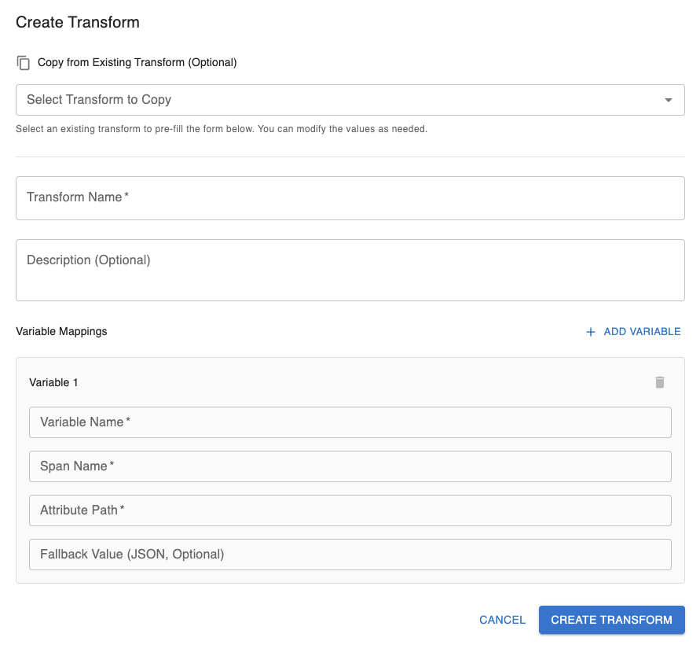
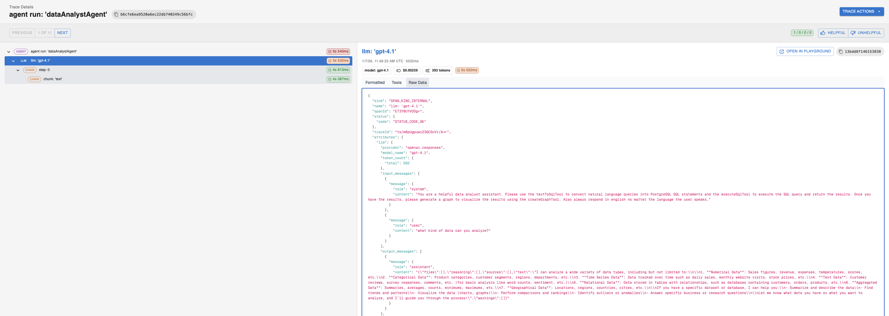
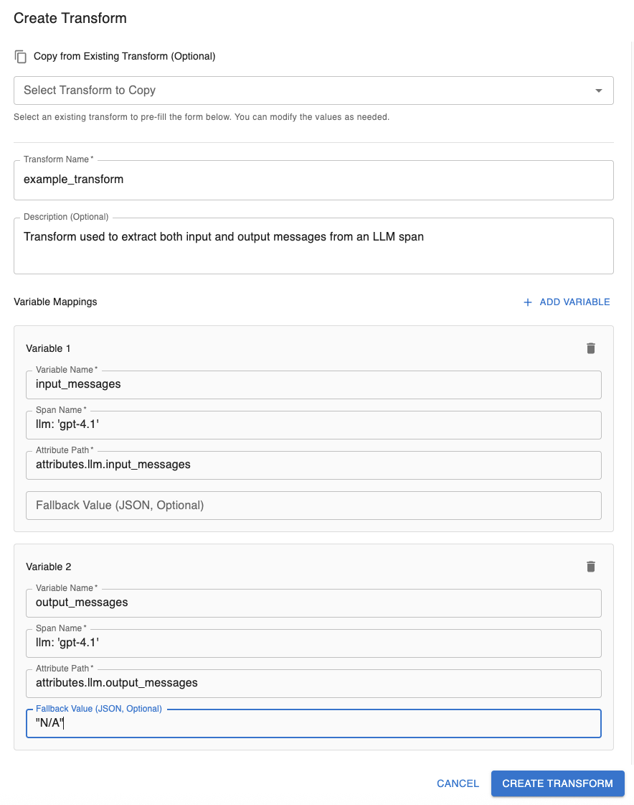

# Get Started With Transforms

## What is a Transform?

A transform is an easy way in which you can link a variable to a specific resource found in the traces being sent to the Arthur platform. For more information on tracing please refer to [this guide](../tracing/get_started_with_tracing.md)

## Prerequisites

- An agentic task setup in the Arthur Engine
- An agent that can send traces to the above task in the Arthur Engine
- Span name + Attribute Path for the type of traces you would like to evaluate

## Setting up a Transform

To create a transform, once you’ve clicked in to the agentic task you would like to create the transform for navigate to Transforms > Create Transform and you will be greeted with this modal:

### Here you can

1. Copy from an existing transform which will copy the existing:
    1. Transform Name
    2. Optional Description
    3. Variables and all of their parameters
2. Create a new transform from scratch

### Required Parameters

- Transform Name
- At least one variable, each of which must have:
    - Variable Name
    - Span Name
    - Attribute Path

### Optional Parameters

- Transform Description
- Fallback Value (per variable)

### Editing a Transform

When editing a transform the same creation modal as pictured above will pop up with all the fields pre-filled. You can freely edit any field and click the “Update Transform” button on the bottom right of the modal to complete your edits

### What is a Fallback Value?

A fallback value is a value you can assign so if a trace doesn’t match the transform exactly, it will still execute properly. For example, if you had an llm agent ‘gpt-4.1’ that failed to generate an output, the system may have sent a trace that contains input messages but no output messages. If we had a fallback value for our variable for output messages set to ‘N/A’, instead of failing to extract the variables we now just see that it wasn’t present in the trace. 

Fallback values are required to be in valid JSON format.

## Example Use Case:

For our example, we will be creating a transform so on all future incoming traces we can have a continuous eval check to see if the output generated by an LLM Agent was helpful given the context of a user’s input messages. 

To do this we will be using a span with the name  `llm: 'gpt-4.1'`  and the attribute paths `attributes.llm.input_messages`  and `attributes.llm.output_messages` which correspond to the input and output messages, respectively. We will also set a fallback value for output messages, “N/A”, in case our agent failed to generate a response but a trace was still sent.

**Note: For this example, we will only be walking you through the steps of setting up the transform. For more information on continuous evals please refer to [this guide](../continuous_evals/get_started_with_continuous_evals.md).*

Here is an example image of what the raw span and attribute path looks like for this trace. The attribute path and span name may differ for your use-case:

Given our span names and attribute paths this is how we would fill in the Create Transform Modal:

**Note: the Fallback Value is surrounded by double quotes to match the expected JSON format requirement*

Now we are ready to use the new transform across our matching experiments and continuous evals

## Resources

- [Guide to setup Tracing](../tracing/get_started_with_tracing.md)
- [Get Started With Continuous Evals](../continuous_evals/get_started_with_continuous_evals.md)
- [Get Started With LLM Evals](../llm_evals/get_started_with_llm_evals.md)
- [Prompt Experiments](../prompts/prompt_experiments_user_guide.md)