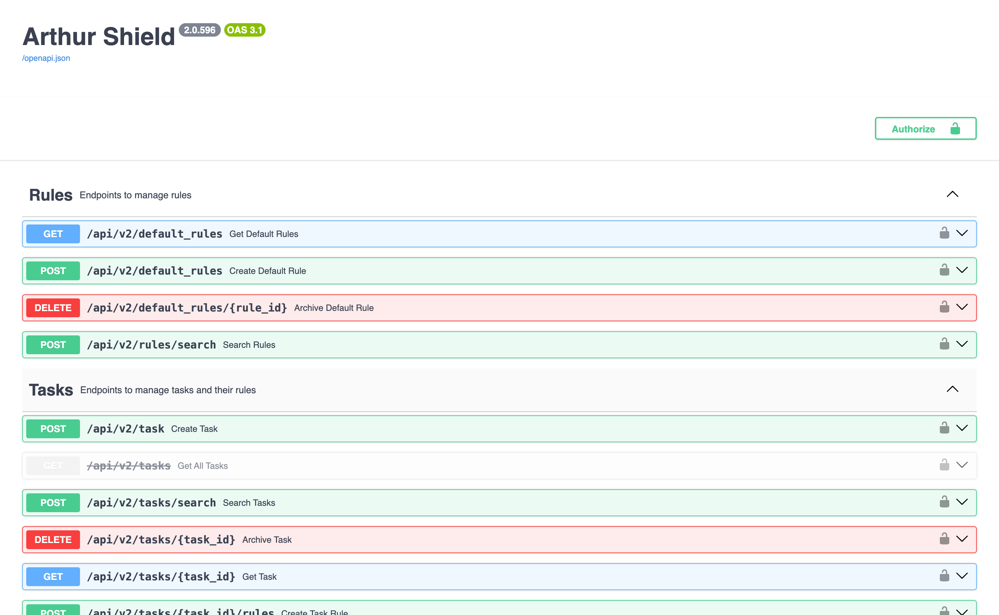

# GenAI Engine

The GenAI Engine (formerly known as Arthur Shield) is **a tool for evaluating and benchmarking large language models (LLMs) and generative AI workflows**. It allows users to measure and monitor response relevance, hallucination rates, token counts, latency, and more. The engine also provides a simple way to **add guardrails to your LLM applications and generative AI workflows**. It has configurable metrics for real-time detection of PII or Sensitive Data leakage, Hallucination, Prompt Injection attempts, Toxic language, and other quality metrics. Arthur Engine can prevent these risks from causing bad user experience in production and negatively impacting your organization's reputation.

## Table of Contents
- [GenAI Engine](#genai-engine)
  - [Table of Contents](#table-of-contents)
  - [Getting Started](#getting-started)
    - [Quickstart](#quickstart)
    - [Usage Examples](#usage-examples)
  - [Documentation](#documentation)
  - [Developer Setup (for Mac)](#developer-setup-for-mac)
    - [Install the Python dependencies with Poetry](#install-the-python-dependencies-with-poetry)
    - [Run Postgres](#run-postgres)
    - [Populate the Database Schema with Alembic](#populate-the-database-schema-with-alembic)
    - [Run the app with an IDE (Visual Studio Code / Cursor example)](#run-the-app-with-an-ide-visual-studio-code--cursor-example)
    - [Run the app via the terminal](#run-the-app-via-the-terminal)
  - [Making your first commit](#making-your-first-commit)
    - [The git pre-commit hooks](#the-git-pre-commit-hooks)
    - [Pytest](#pytest)
    - [Security check for endpoints](#security-check-for-endpoints)
  - [Unit Tests](#unit-tests)
  - [Integration Tests](#integration-tests)
  - [Performance Tests](#performance-tests)

## Getting Started

There are a several ways to run the GenAI Engine:
* [Docker Compose](docker-compose/README.md)
* [Cloudformation](cloudformation/README.md) for AWS deployment with Elastic Container Service (ECS)
* [Helm Chart](helm/README.md) for Kubernetes

Note: The GenAI Engine is currently limited to providing you with the guardrail features. The rest of the features are coming soon!

### Quickstart
1. Follow the [Docker Compose](docker-compose/README.md) instructions to deploy the engine on your local machine
2. Once your `genai-engine` is up and running, navigate to its interactive API documentation at `/docs` via a browser
3. Create an API key by referring to [the API Authentication Guide](https://shield.docs.arthur.ai/docs/api-authentication-guide). Your admin key is the `GENAI_ENGINE_ADMIN_KEY` in the `docker-compose/arthur-genai-engine.env` file.
4. Provide `/docs` the access to use the API endpoints by entering your new API key, via the "Authorize" button, located at the top right of the page
5. Create a new task (use case/LLM application) by expanding the `POST /api/v2/task` endpoint on the `/docs` page. Click on "Try it out", provide a task name, and click "Execute".
6. Configure evaluation rules in the newly created task with the `POST /api/v2/tasks/{task_id}/rules` endpoint
7. Run LLM prompt and generated response evaluations by using the "Task Based Validation" endpoints. For the response validation endpoint, "context" must be provided for the hallucination rule if it's enabled. Hallucinations are generated responses characterized as incorrect or unfaithful responses given a user input and source knowledge (context). The context is often the Retrieval-Augmented Generation(RAG) data from your LLM application.
8. Try the default rules, which are global rules that are automatically applied to every task



For more information, refer to the [User Guide](https://shield.docs.arthur.ai).

### Usage Examples
* [GenAI Engine client example notebooks](https://github.com/arthur-ai/example-shield-notebooks)
* [An example of protecting an Agentic Application with GenAI Engine](https://github.com/arthur-ai/shield-autogen-agent-demo)

## Documentation

* [User Guide](https://shield.docs.arthur.ai)
* API Documentation - (`/docs` on your GenAI Engine instance)

## Developer Setup (for Mac)

### Install the Python dependencies with Poetry

1. Git clone the repo
2. Install Poetry: Poetry is a Python dependency management framework. `pyproject.toml` is the descriptor.
    ```bash
    pip install poetry
    ```
3. Set the proper Python version: Currently developed and tested with `3.12.8`
    ```bash
    cd genai-engine

    poetry self add poetry-plugin-shell
    poetry shell && poetry env use 3.12
    ```
4. Install dependencies/packages
    ```bash
    poetry install
    ```
    To add (or upgrade) a dependency, use the following command:
    ```bash
    poetry add <package_name>==<package_version>
    ```
    To add (or upgrade) a dev dependency, use the following command:
    ```bash
    poetry add --group dev <package_name>==<package_version>
    ```

### Run Postgres

A Postgres database is required to run the GenAI Engine. The easiest way to get started is to run Postgres using Docker.

1. Install and run Docker for Mac
2. `cd` to the `genai-engine` folder
3. Run `docker compose up`
4. Login with `postgres/changeme_pg_password`

### Populate the Database Schema with Alembic

The Alembic database migration tool needs to be run the first time and every time a new database schema change is added.
Maks sure the Poetry install is complete and you have a running Postgres instance first.

`cd` to `/genai-engine` and run the commands below:

```bash
export POSTGRES_USER=postgres
export POSTGRES_PASSWORD=changeme_pg_password
export POSTGRES_URL=localhost
export POSTGRES_PORT=5432
export POSTGRES_DB=arthur_genai_engine
export POSTGRES_USE_SSL=false
export PYTHONPATH="src:$PYTHONPATH"

poetry run alembic upgrade head
```

### Run the app with an IDE (Visual Studio Code / Cursor example)

1. Install the IDE
2. Install the recommended extensions
   - Python
   - Docker
   - CloudFormation
   - Kubernetes
   - Markdown All in One
3. Open a new window and select the `genai-engine` folder
4. Find the path to the interpreter used by the Poetry environment
    ```bash
    poetry env info --path
    ```
5. Open a Python file (e.g. `src/server.py`) and make sure you have the Python interpreter looked up in the previous step selected
6. Create a new launch configuration: `Run` -> `Add Configurations` -> `Python Debugger` -> `Python File `. Add the below configuration and adjust the values according to your environment. Please reference the `.env` file.
    ```json
        {
            "name": "GenAI Engine",
            "type": "python",
            "request": "launch",
            "module": "uvicorn",
            "args": [
                "src.server:get_app",
                "--reload"
            ],
            "jinja": true,
            "justMyCode": false,
            "env": {
                "PYTHONPATH": "src",

                "POSTGRES_USER": "postgres",
                "POSTGRES_PASSWORD": "changeme_pg_password",
                "POSTGRES_URL": "localhost",
                "POSTGRES_PORT": "5432",
                "POSTGRES_DB": "arthur_genai_engine",
                "POSTGRES_USE_SSL": "false",
                "GENAI_ENGINE_ENABLE_PERSISTENCE": "enabled",

                "GENAI_ENGINE_ENVIRONMENT":"local",
                "GENAI_ENGINE_ADMIN_KEY": "changeme123",
                "GENAI_ENGINE_INGRESS_URI": "http://localhost:8000",

                "GENAI_ENGINE_OPENAI_PROVIDER": "Azure",
                "GENAI_ENGINE_OPENAI_GPT_NAMES_ENDPOINTS_KEYS": "model_name::https://my_service.openai.azure.com/::my_api_key"
            }
        }
    ```
7. `Run` -> `Run Without Debugging` / `Start Debugging`
8. Open `http://localhost:8000/docs` in your web browser and start building!

### Run the app via the terminal

1. Load a dedicated Python environment with a compatible Python version (i.e. `3.12`)
2. [Install the Python dependencies with Poetry](#install-the-python-dependencies-with-poetry)
3. Set the following environment variables:
    ```
    export POSTGRES_USER=postgres
    export POSTGRES_PASSWORD=changeme_pg_password
    export POSTGRES_URL=localhost
    export POSTGRES_PORT=5432
    export POSTGRES_DB=arthur_genai_engine
    export POSTGRES_USE_SSL=false
    export GENAI_ENGINE_ENABLE_PERSISTENCE=enabled

    export GENAI_ENGINE_ENVIRONMENT=local
    export GENAI_ENGINE_ADMIN_KEY=changeme123
    export GENAI_ENGINE_INGRESS_URI=http://localhost:8000

    export GENAI_ENGINE_OPENAI_PROVIDER=Azure
    export OPENAI_API_VERSION=2023-07-01-preview
    export GENAI_ENGINE_OPENAI_GPT_NAMES_ENDPOINTS_KEYS=model_name::https://my_service.openai.azure.com/::my_api_key
    ```
4. Run the server
    ```bash
    export PYTHONPATH="src:$PYTHONPATH"
    poetry run serve
    ```

## Making your first commit

### The git pre-commit hooks
Review the [../CONTRIBUTE.MD](CONTRIBUTE.MD) document carefully.
Make sure the git pre-commit hooks are installed properly.

### Pytest

As part of the pre-commit hook, Pytest unit tests are executed.
You can disable it with following command when making a commit that's not ready for testing:

```bash
SKIP=genai-engine-pytest-check git commit -m "<your message>"
```

### Security check for endpoints

The pre-commit hook also runs a check to make sure that all endpoints have been evaluated for access control
using the below script.

```bash
poetry run python routes_security_check.py
```

Script accepts the following arguments:
- `--log-level`: Set the logging level. The default is `INFO`.
- `--short`: Print only the summary
- `--files-summary`: Print the summary of each file

## Unit Tests

Run the unit tests with the following command:
```bash
poetry run pytest -m "unit_tests"
```

Run the unit tests with coverage:
```bash
poetry run pytest -m "unit_tests" --cov=src --cov-fail-under=79
```

## Integration Tests

1. Make sure you have a running instance of genai-engine on your local machine
2. Set the below envars
    ```bash
    export REMOTE_TEST_URL=http://localhost:8000
    export REMOTE_TEST_KEY=changeme123
    ```
3. Run the below shell script from the `genai-engine` directory
    ```bash
    ./tests/test_remote.sh
    ```

## Performance Tests
For running performance tests, we use [Locust](https://locust.io/).

Follow the steps below to run performance tests:

1. Install Locust
    ```bash
    poetry install --only performance
    ```
2. Run performance tests by referring to the [Locust README](locust/README.md)
