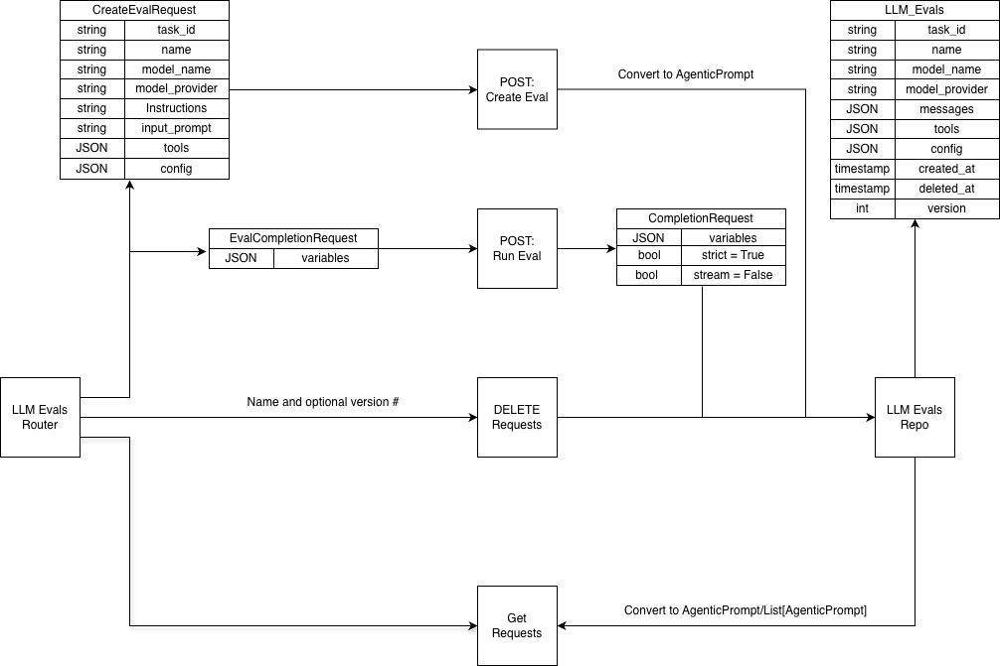

# Prompts LLM Evals Lifecycle Technical Design Doc

## Backend

### Modifications

- Option 1:
    - Create an LLM Evals table that will hold all the eval prompts (however they would still just be AgenticPrompts on the backend)
    - Langfuse doesn’t seem to enforce unique name constraints for llm evals like we have for prompts they have an id. Not sure if we want to continue with that enforcement or not for this option
    - LLM Evals Repository:
        - get_all_evals:
            - Inputs:
                - task_id: str
                - pagination_params: PaginationParameters
                - filter_request: LLMEvalsFilterRequest
            - Outputs: AgenticPromptMetadataListResponse
        - get_eval_versions:
            - Inputs:
                - task_id: str
                - eval_id: str
                - pagination_params: PaginationParameters
                - filter_request: LLMEvalsFilterRequest
            - Outputs: AgenticPromptVersionListResponse
        - get_eval:
            - Inputs:
                - task_id: str
                - eval_id: str
                - version: str (latest, number or timestamp)
            - Outputs: AgenticPrompt
        - save_eval:
            - Inputs:
                - task_id: str
                - eval_request: CreateEvalRequest (in diagram below)
            - Outputs: AgenticPrompt
        - soft_delete_eval_version:
            - Inputs:
                - task_id: str
                - eval_id: str
                - version: str  (latest, number or timestamp)
            - Outputs: None
        - delete_eval:
            - Inputs:
                - task_id: str
                - eval_id: str
            - Outputs: None
- Option 2:
    - new enum to be added to the agentic_prompt class for whether the prompt is a “prompt” or an “llm_eval”. (< 1 day)
    - Update prompts table to have a new column for the enum so we can filter based on prompt type for the existing endpoints and the new ones mentioned below (< 1 day)
    - change “/completions” to only allow running prompts of type “prompt” not llm_eval since those should run a saved prompt through the other completions route (< 1 day)
    - change /tasks/{task_id}/prompts to only return prompts of type “prompt” (< 1 day)
    - change /tasks/{task_id}/prompts/{prompt_id}/versions to only allow returning prompts of type “prompt” (< 1 day)
    - change save endpoint to save prompts of only type ‘prompt’ (< 1 day)

### Proposed new endpoints (1-2 days closer to 1 most likely)

- POST: /tasks/{task_id}/llm_evals - Creates a new version of a prompt which has the following parameters:
    - Request:
        - required:
            - name
            - model_provider
            - model_name
            - “evaluation_prompt” (or instruction and input prompts)
                - Langfuse seems to treat this as one user prompt. I think it makes more sense to have an instruction section vs an input section. The former being a system prompt and latter a user prompt. Both would still allow variables.
            - score reasoning prompt - how the llm should explain its evaluation (will be in the response_format)
            - score range (also in the response_format, this will be static and binary to start we can expose this to the user in the future if we want)
            - Force type to be llm_eval (not exposted to user if option 2)
        - Optional:
            - The rest of the config settings (e.g. temperature) present in other prompts
    - Response:
        - AgenticPrompt
    - Functionality:
        - Uses the request parameters to create an agentic prompt
        - The AgenticPrompt will have a system prompt message containing instructions the llm-as-a-judge should use and the user input message with the variables to be updated during the run.
        - Sets the response_format as as structured output (if supported otherwise json schema or with a parameter to hold the binary score and a string that will be the llm’s reasoning for the score (should be the same whether we expose this to the user or not).
        - Use litellm’s supports_response_schema to verify the model uses structured outputs
- GET: /tasks/{task_id}/llm_evals - Lists all llm evals
    - Request:
        - force filter type to be llm_eval (not exposed to user) if option 2 otherwise use llm evals table
        - sorting/filtering/pagination similar to agentic prompt
    - Response:
        - List[AgenticPrompt]
- GET: /tasks/{task_id}/llm_evals/{evaluator_id} - Lists all versions of a specific llm_eval
    - Err if not type llm_eval
- If Choosing Option 1 above:
    - POST: /tasks/{task_id}/llm_evals/{eval_id}/completions or /tasks/{task_id}/llm_evals/{eval_id}/versions/{version}/completions if we still want versioning - Run an llm eval
        - Request:
            - new type of CompletionRequest that let’s variables be set but forces strict mode = True, stream = False (in diagram)
        - Response:
            - AgenticPromptRunResponse
    - DELETE: /tasks/{task_id}/llm_evals/{eval_id}/versions/{version} - soft-delete a version of an llm eval
    - DELETE: /tasks/{task_id}/llm_evals/{eval_id} - Delete all versions of an llm eval
- Future additions:
    - either a new endpoint or modify the existing completions endpoint with a dataset_id/or list of trace ids/etc to run completions in bulk without needing to make multiple requests

### Template llm evaluators

- Incorporate Ragas - Extract and send the formatted prompts for Martin to have on the frontend (< 1 day)
- Creating our own custom llm-as-a-judge evals (the list below is straight from langfuse but we can change it)
    - Conciseness
    - Context correctness
    - context relevance
    - hallucination
    - helpfulness
    - relevance
    - toxicity
    - In terms of timing for each of these I could see each being 1 day, a few days or potentially even longer. Not sure how much time we want to dedicate to each of these. But finding datasets to benchmark each of these evaluators and iterating to find the best llm-as-a-judge prompt can definitely take some time.

### Questions

- Do we want to have a new separate llm_evals router or add these routes to the existing prompts router?
- I assume we want “GET: /tasks/{task_id}/prompts” to return only the prompts that will be of type ‘prompt’ after making the enum above. Do we want to have a separate get request to get all prompts and llm_evals?
- For getting a specific version, deleting all versions and deleting a specific version of an llm eval do we want to make new routes for it or use the existing prompt routes? because the functionality would be identical just under a different route name
- rn we have a unique constraint for prompt names, task_id and version. with the addition of type we could add it to the constraint so we could technically have duplicate names as long as they are different prompt types. Or, we could create an llm_evals table to keep them separate?
- Do we want to have a separate table and foreign key (as described in ian’s comment to the above question) to the prompt in the prompts table or keep it entirely separate? I would be leaning towards keeping it entirely separate so management in the prompts repo/table wouldn’t need to worry about llm evals at all (needing to add a new column/enum etc.) but there would be a lot of duplicated fields if we did that in the llm_evals table since it’s basically just an AgenticPrompt.

### Diagram



- **Recommendation**: Option 1. Although evals are effectively the same right now as prompts, option 1 gives us the freedom to expand on LLM Evals if we want to add params or differing functionality from prompts in the future

## Frontend

- Create template prompts for pre-built metrics. These will be static strings we can load in as the eval prompt. For example,  answer correctness from ragas could look like:

```
-----------------------------------------------------
Instruction (System) Prompt:

Given a ground truth and an answer statements, analyze each statement and classify them in one of the following categories: TP (true positive): statements that are present in answer that are also directly supported by the one or more statements in ground truth, FP (false positive): statements present in the answer but not directly supported by any statement in ground truth, FN (false negative): statements found in the ground truth but not present in answer. Each statement can only belong to one of the categories. Provide a reason for each classification.

Examples: {{examples}}

-----------------------------------------------------
Input (User) Prompt:

ground truth: {{ground_truth}}
answer: {{answer}}

-----------------------------------------------------
```

- Tal - Extract and send prompts for Martin to use
- Martin - Implement the pre-built prompts on the frontend