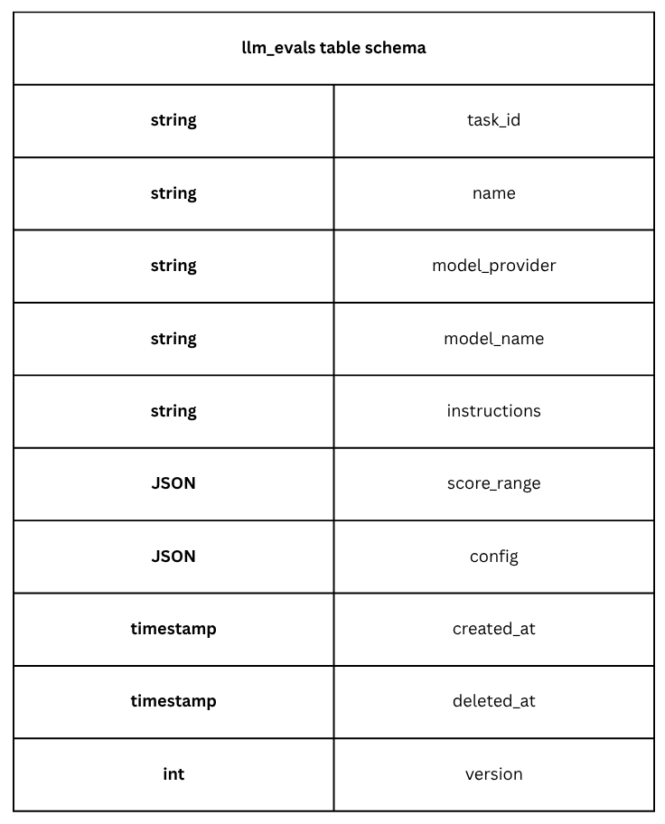
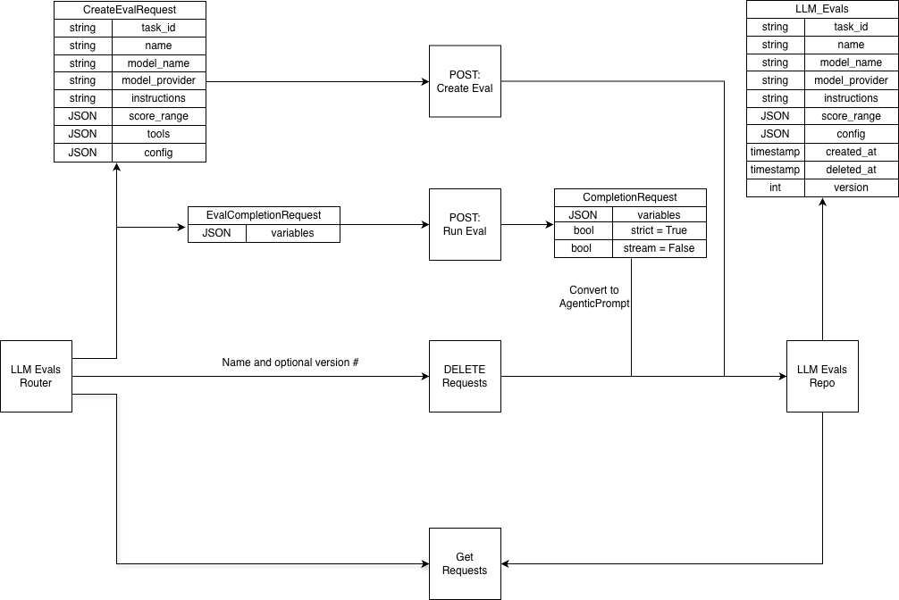
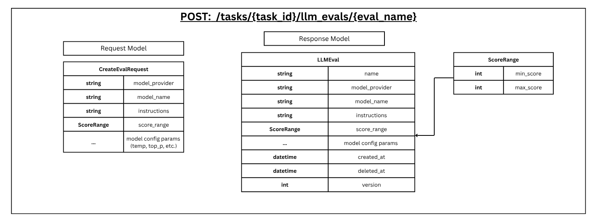
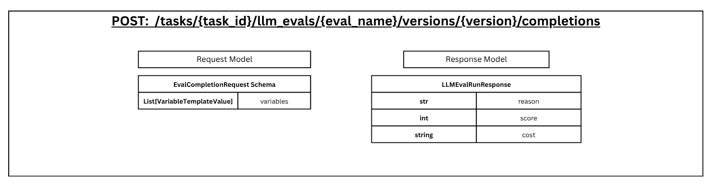
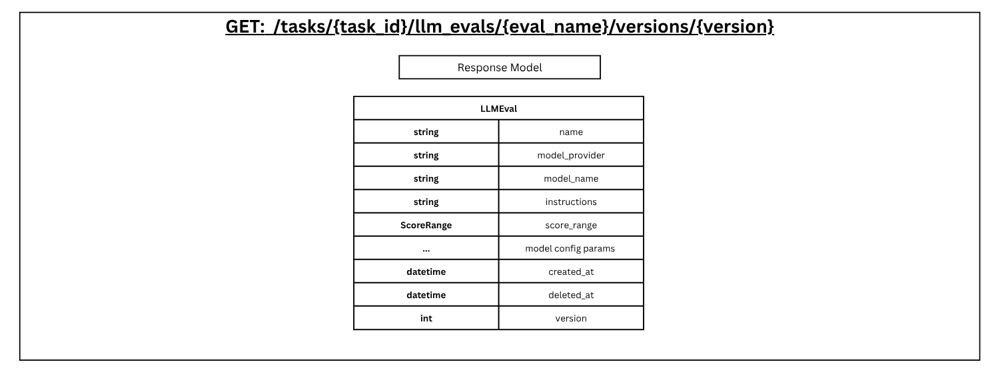
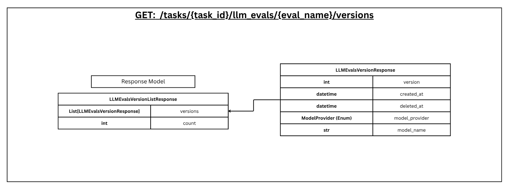
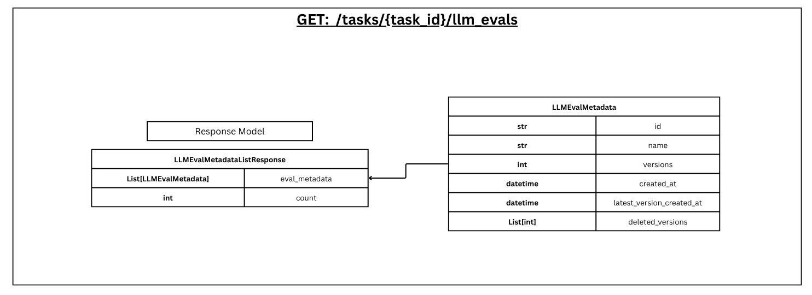
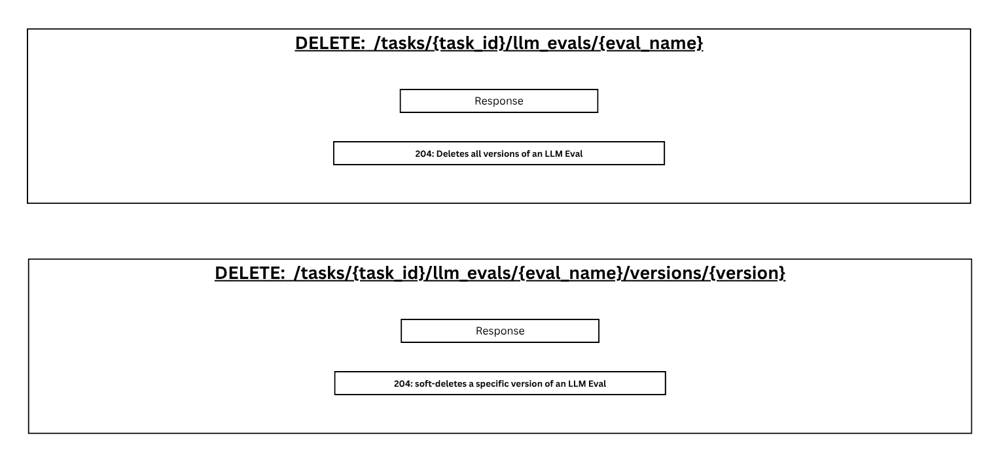

# Prompts LLM Evals Lifecycle Technical Design Doc

## Backend

### DB
- Create an LLM Evals table that will hold all the eval prompts
- DB Schema:
    ```
    task_id: str
    name: str
    model_provider: str
    model_name: str
    instructions: str
    score_range: JSON (a min_score and max_score range defaults to boolean)
    config: JSON
    created_at: timestamp
    deleted_at: timestamp
    version: int
    ```
- enforce same unique constraint as agentic prompts for task_id, name and version, and also have a unique id exclusive to the table

### Class Schemas:
- ScoreRange
  ```python
  min_score: int
  max_score: int
  ```

- LLMEvalMetadata:
  ```python
  name: str
  versions: int
  created_at: datetime
  latest_version_created_at: datetime
  deleted_versions: List[int]
  ```

- LLMEvalMetadataListResponse
    ```python
    eval_metadata: List[LLMEvalMetadata]
    count: int
    ```

- LLMEvalsGetAllFilterRequest
    ```python
    eval_names: Optional[list[str]]
    model_provider: Optional[ModelProvider]
    model_name: Optional[str]
    created_after: Optional[datetime]
    created_before: Optional[datetime]
    ```

- LLMEvalsGetVersionsFilterRequest
    ```python
    model_provider: Optional[ModelProvider]
    model_name: Optional[str]
    created_after: Optional[datetime]
    created_before: Optional[datetime]
    exclude_deleted: Optional[bool]
    min_version: Optional[int]
    max_version: Optional[int]
    ```

- LLMEvalsVersionResponse
    ```python
    version: int
    created_at: datetime
    deleted_at: Optional[datetime]
    model_provider: ModelProvider
    model_name: str
    ```

- LLMEvalsVersionListResponse
    ```python
    versions: list[LLMEvalsVersionResponse]
    count: int
    ```

- LLMEvalResponseFormat
  ```python
  score_range: [ScoreRange | bool]
  reasoning: str
  ```

- LLMEvalRunRequest
  ```python
  variables: Optional[List[VariableTemplateValue]]
  ```

- LLMEval:
    ```python
    instructions: str
    model_name: str
    model_provider: ModelProvider
    version: int
    score_range: ScoreRange
    timeout: Optional[float]
    temperature: Optional[float]
    top_p: Optional[float]
    max_tokens: Optional[int]
    stop: Optional[str]
    presence_penalty: Optional[float]
    frequency_penalty: Optional[float]
    seed: Optional[int]
    logprobs: Optional[bool]
    top_logprobs: Optional[int]
    logit_bias: Optional[List[LogitBiasItem]]
    max_completion_tokens: Optional[int]
    reasoning_effort: Optional[ReasoningEffortEnum]
    thinking: Optional[AnthropicThinkingParam]
    created_at: Optional[datetime]
    deleted_at: Optional[datetime]
    ```

- CreateEvalRequest
    ```python
    instructions: str
    model_name: str
    model_provider: ModelProvider
    timeout: Optional[float]
    temperature: Optional[float]
    top_p: Optional[float]
    max_tokens: Optional[int]
    stop: Optional[str]
    presence_penalty: Optional[float]
    frequency_penalty: Optional[float]
    seed: Optional[int]
    logprobs: Optional[bool]
    top_logprobs: Optional[int]
    logit_bias: Optional[List[LogitBiasItem]]
    max_completion_tokens: Optional[int]
    reasoning_effort: Optional[ReasoningEffortEnum]
    thinking: Optional[AnthropicThinkingParam]
    ```

- LLMEvalRunResponse:
  ```python
  score: [int | bool]
  reason: str
  cost: float
  ```

### Repository
- LLM Evals Repository:
    - get_all_evals:
        - Inputs:
            - task_id: str
            - pagination_params: PaginationParameters
            - filter_request: LLMEvalsGetAllFilterRequest
        - Outputs: LLMEvalMetadataListResponse
    - get_eval_versions:
        - Inputs:
            - task_id: str
            - eval_id: str
            - pagination_params: PaginationParameters
            - filter_request: LLMEvalsGetVersionsFilterRequest
        - Outputs: LLMEvalsVersionListResponse
    - get_eval:
        - Inputs:
            - task_id: str
            - eval_id: str
            - version: str (latest, number or timestamp)
        - Outputs: LLMEval
    - save_eval:
        - Inputs:
            - task_id: str
            - eval_request: CreateEvalRequest (in diagram below)
        - Outputs: AgenticPrompt
    - soft_delete_eval_version:
        - Inputs:
            - task_id: str
            - eval_id: str
            - version: str  (latest, number or timestamp)
        - Outputs: None
    - delete_eval:
        - Inputs:
            - task_id: str
            - eval_id: str
        - Outputs: None

### LLM Evals Router

- POST: /tasks/{task_id}/llm_evals - Creates a new version of a prompt which has the following parameters:
    - Request:
      - CreateEvalRequest
        - required:
            - name
            - model_provider
            - model_name
            - instructions
            - score range
        - Optional:
            - The rest of the LLM config settings (e.g. temperature)
    - Response:
        - LLMEval
    - Functionality:
        - Uses the request parameters to create an LLMEval and save it to the llm_evals table
- GET: /tasks/{task_id}/llm_evals - Lists all llm evals
    - Request:
        - PaginationParameters
        - LLMEvalsGetAllFilterRequest
    - Response:
        - LLMEvalMetadataListResponse
- GET: /tasks/{task_id}/llm_evals/{evaluator_id}/versions - Lists all versions of a specific llm_eval
    - Request:
      - PaginationParameters
      - LLMEvalsGetVersionsFilterRequest
    - Response:
      - LLMEvalsVersionListResponse
- POST: /tasks/{task_id}/llm_evals/{eval_id}/versions/{version}
    - Request:
      - LLMEvalRunRequest
    - Response:
        - LLMEvalRunResponse
    - Functionality:
      - grabs an llm_eval from the db
      - converts it to an AgenticPrompt by setting the instructions to the system prompt and converting the LLMEvalResponseFormat to a properly formatted response_format in OpenAI formatting style
      - Converts the LLMEvalRunRequest to an AgenticPromptRunRequest with the same variables, strict=True, stream=False
      - run chat completion
- DELETE: /tasks/{task_id}/llm_evals/{eval_id}/versions/{version} - soft-delete a version of an llm eval
- DELETE: /tasks/{task_id}/llm_evals/{eval_id} - Delete all versions of an llm eval
- Future additions:
    - either a new endpoint or modify the existing completions endpoint with a dataset_id/or list of trace ids/etc to run completions in bulk without needing to make multiple requests

### Template llm evaluators

- Incorporate Ragas - Extract and send the formatted prompts for Martin to have on the frontend (< 1 day)
- Creating our own custom llm-as-a-judge evals (the list below is straight from langfuse but we can change it)
    - Conciseness
    - Context correctness
    - context relevance
    - hallucination
    - helpfulness
    - relevance
    - toxicity
    - In terms of timing for each of these I could see each being 1 day, a few days or potentially even longer. Not sure how much time we want to dedicate to each of these. But finding datasets to benchmark each of these evaluators and iterating to find the best llm-as-a-judge prompt can definitely take some time.


### Diagrams









### Examples

- POST: /tasks/{task_id}/llm_evals/{eval_name}
    - Input:
        ```json
        {
            "model_name": "gpt-4o",
            "model_provider": "openai",
            "instructions": "Given a ground truth and an answer statements, analyze each statement and classify them in one of the following categories: TP (true positive): statements that are present in answer that are also directly supported by the one or more statements in ground truth, FP (false positive): statements present in the answer but not directly supported by any statement in ground truth, FN (false negative): statements found in the ground truth but not present in answer. Each statement can only belong to one of the categories. Provide a reason for each classification. Examples: {{examples}}",
            "score_range": {
                "min_score": 0,
                "max_score": 1
            },
            "temperature": 0
        }
        ```
    - Response:
        ```json
        {
            "name": "{eval_name}",
            "model_name": "gpt-4o",
            "model_provider": "openai",
            "instructions": "Given a ground truth and an answer statements, analyze each statement and classify them in one of the following categories: TP (true positive): statements that are present in answer that are also directly supported by the one or more statements in ground truth, FP (false positive): statements present in the answer but not directly supported by any statement in ground truth, FN (false negative): statements found in the ground truth but not present in answer. Each statement can only belong to one of the categories. Provide a reason for each classification. Examples: {{examples}}",
            "score_range": {
                "min_score": 0,
                "max_score": 1
            },
            "temperature": 0,
            "version": 1,
            "created_at": "2025-10-31T09:23:45-05:00",
            "deleted_at": null
        }
        ```

- POST: /tasks/{task_id}/llm_evals/{eval_name}/versions/{version}/completions
  - Input: 
    ```json
    {
        "variables": [
            {"name": "ground_truth", "value": "The sky is blue"},
            {"name": "answer", "value": "The sky is green"}
        ]
    }
    ```
  - BE Conversion: 
    ```json
    {
        "variables": [
            {"name": "ground_truth", "value": "The sky is blue"},
            {"name": "answer", "value": "The sky is green"}
        ],
        "strict": true,
        "stream": false,
    }
    ```
  - Response: 
    ```json
    {
        "score": 1,
        "reasoning": "The answer statements mostly align with the ground truth, with only minor omissions that do not affect accuracy.",
        "cost": 0.00012,
    }
    ```    

- GET: /tasks/{task_id}/llm_evals/{eval_name}/versions/{version}
    ```json
    {
        "name": "{eval_name}",
        "model_name": "gpt-4o",
        "model_provider": "openai",
        "instructions": "Given a ground truth and an answer statements, analyze each statement and classify them in one of the following categories: TP (true positive): statements that are present in answer that are also directly supported by the one or more statements in ground truth, FP (false positive): statements present in the answer but not directly supported by any statement in ground truth, FN (false negative): statements found in the ground truth but not present in answer. Each statement can only belong to one of the categories. Provide a reason for each classification. Examples: {{examples}}",
        "score_range": {
            "min_score": 0,
            "max_score": 1
        },
        "temperature": 0,
        "version": 1,
        "created_at": "2025-10-31T09:23:45-05:00"
    }
    ```    

- GET: /tasks/{task_id}/llm_evals/{eval_name}/versions
    ```json
    {
        "versions": [
            "version": 1,
            "created_at": "2025-10-20T09:23:45-05:00",
            "deleted_at": null,
            "model_provider": "openai",
            "model_name": "gpt-4o",
        ],
        "count": 1
    }
    ```   

- GET: /tasks/{task_id}/llm_evals
    ```json
    {
        "eval_metadata": [
            "name": "test_eval",
            "versions": 3,
            "created_at": "2025-10-31T09:23:45-05:00",
            "latest_version_created_at": "2025-10-31T09:23:45-05:00",
            "deleted_versions": [1, 2]
        ],
        "count": 1
    }
    ```   

- DELETE: /tasks/{task_id}/llm_evals/{eval_name}
    - 204 no content response, deletes all versions of an eval

- DELETE: /tasks/{task_id}/llm_evals/{eval_name}/versions/{version}
    - 204 no content response, soft-deletes a specific version of an eval


### Tasks
- Create llm_evals table (<1 day)
- Save an llm_eval (<1 day)
- Run a saved llm_eval (<1 day)
- Create get requests for llm_evals (~1 day)
- Create delete requests for llm_evals (<1 day)
- Extract Ragas prompts for FE (<1 day)
- Run llm evals over entire datasets/traces (future work, just noting it so we don't lose track)

## Frontend

### Ragas Metrics
- Create template prompts for pre-built metrics. These will be static strings we can load in as the eval prompt.
- Answer Correctness:
```python
"""
Given a ground truth and answer statements, analyze each statement and classify them in one of the following categories: TP (true positive): statements that are present in answer that are also directly supported by the one or more statements in ground truth, FP (false positive): statements present in the answer but not directly supported by any statement in ground truth, FN (false negative): statements found in the ground truth but not present in answer. Each statement can only belong to one of the categories. You must then give a boolean score, 0 if any statements are classified as FP or FN and 1 if all statements are TP or TN (can be a mix of TP and TN). Provide a reason for each classification.

Examples:
    1.  Inputs:
        question="What powers the sun and what is its primary function?"
        ground_truth=[
            "The sun is powered by nuclear fusion, where hydrogen atoms fuse to form helium.",
            "This fusion process in the sun's core releases a tremendous amount of energy.",
            "The energy from the sun provides heat and light, which are essential for life on Earth.",
            "The sun's light plays a critical role in Earth's climate system.",
            "Sunlight helps to drive the weather and ocean currents.",
        ]
        answer_statments=[
            "The sun is powered by nuclear fission, similar to nuclear reactors on Earth.",
            "The primary function of the sun is to provide light to the solar system.",
        ]

        Response:
            ReasonedScore(
                reason="The statement, 'The sun is powered by nuclear fission, similar to nuclear reactors on Earth.' is a False Positive. This statement is incorrect and contradicts the ground truth which states that the sun is powered by nuclear fusion.",
                score=0
            )

    2.  Inputs:
        question="What is the boiling point of water?"
        ground_truth=[
            "The boiling point of water is 100 degrees Celsius (212 degrees Fahrenheit) at sea level.",
            "The boiling point of water can change with altitude.",
        ]
        answer_statments=[
            "The boiling point of water is 100 degrees Celsius at sea level",
        ]

        Response:
            [ReasonedScore(
                reason="The statement, 'The boiling point of water is 100 degrees Celsius at sea level' is a True Positive. It is directly supported by the ground truth which specifies the boiling point of water as 100 degrees Celsius at sea level. Since all statements are TP or TN the score is 1.",
                score=1),
            ]

Input:
---
Question: {{question}}
---
Ground Truth: {{ground_truth}}
---
Answer Statements: {{answer_statements}}
"""
```
- Aspect Critic
```python
"""
Evaluate the Input based on the criteria defined. Use only 'Yes' (1) and 'No' (0) as verdict.\nCriteria Definition: {{criteria_definition}}

Input:
{{input}}
"""
```
- Answer Relevance
```python
"""
Generate a question for the given answer and Identify if answer is noncommittal. Give noncommittal as 1 if the answer is noncommittal and 0 if the answer is committal. A noncommittal answer is one that is evasive, vague, or ambiguous. For example, "I don't know" or "I'm not sure" are noncommittal answers

Examples:
    1.  Inputs:
        response="Albert Einstein was born in Germany."

        Response:
            ReasonedScore(
                reason="Where was Albert Einstein born?",
                score=0)

    2.  Inputs:
        response="I don't know about the  groundbreaking feature of the smartphone invented in 2023 as am unaware of information beyond 2022."

        Response:
            ReasonedScore(
                reason="What was the groundbreaking feature of the smartphone invented in 2023?",
                score=0),

Input:
{{input}}
"""
```
- Context Precision
```python
"""
Given question, answer and context verify if the context was useful in arriving at the given answer. Give verdict as "1" if useful and "0" if not with json output.

Examples:
    1.  Inputs:
        question="What can you tell me about Albert Einstein?"
        context="Albert Einstein (14 March 1879 – 18 April 1955) was a German-born theoretical physicist, widely held to be one of the greatest and most influential scientists of all time. Best known for developing the theory of relativity, he also made important contributions to quantum mechanics, and was thus a central figure in the revolutionary reshaping of the scientific understanding of nature that modern physics accomplished in the first decades of the twentieth century. His mass–energy equivalence formula E = mc2, which arises from relativity theory, has been called 'the world's most famous equation'. He received the 1921 Nobel Prize in Physics 'for his services to theoretical physics, and especially for his discovery of the law of the photoelectric effect', a pivotal step in the development of quantum theory. His work is also known for its influence on the philosophy of science. In a 1999 poll of 130 leading physicists worldwide by the British journal Physics World, Einstein was ranked the greatest physicist of all time. His intellectual achievements and originality have made Einstein synonymous with genius."
        answer="Albert Einstein, born on 14 March 1879, was a German-born theoretical physicist, widely held to be one of the greatest and most influential scientists of all time. He received the 1921 Nobel Prize in Physics for his services to theoretical physics."

        Response:
            ReasonedScore(
                reason="The provided context was indeed useful in arriving at the given answer. The context includes key information about Albert Einstein's life and contributions, which are reflected in the answer.",
                score=1
            )

    2.  Inputs:
        question="who won 2020 icc world cup?"
        context="The 2022 ICC Men's T20 World Cup, held from October 16 to November 13, 2022, in Australia, was the eighth edition of the tournament. Originally scheduled for 2020, it was postponed due to the COVID-19 pandemic. England emerged victorious, defeating Pakistan by five wickets in the final to clinch their second ICC Men's T20 World Cup title."
        answer="England"

        Response:
            ReasonedScore(
                reason="the context was useful in clarifying the situation regarding the 2020 ICC World Cup and indicating that England was the winner of the tournament that was intended to be held in 2020 but actually took place in 2022.",
                score=1
            )

    3.  Inputs:
        question="What is the tallest mountain in the world?"
        context="The Andes is the longest continental mountain range in the world, located in South America. It stretches across seven countries and features many of the highest peaks in the Western Hemisphere. The range is known for its diverse ecosystems, including the high-altitude Andean Plateau and the Amazon rainforest.",
        answer="Mount Everest."

        Response:
            ReasonedScore(
                reason="the provided context discusses the Andes mountain range, which, while impressive, does not include Mount Everest or directly relate to the question about the world's tallest mountain.",
                score=0
            )

Input:
---
Question: {{question}}
---
Context: {{context}}
---
Answer: {{answer}}
"""
```
- Context Recall
```python
"""
Given a context, and an answer, analyze each sentence in the answer and classify if the sentence can be attributed to the given context or not. If all sentences can be attributed to the given context, you should give a score of 'Yes' (1), otherwise give a score of 'No' (0) as a binary classification. Output json with reason.

Examples:
    1.  Inputs:
        question="What can you tell me about Albert Einstein?"
        context="Albert Einstein (14 March 1879 - 18 April 1955) was a German-born theoretical physicist, widely held to be one of the greatest and most influential scientists of all time. Best known for developing the theory of relativity, he also made important contributions to quantum mechanics, and was thus a central figure in the revolutionary reshaping of the scientific understanding of nature that modern physics accomplished in the first decades of the twentieth century. His mass-energy equivalence formula E = mc2, which arises from relativity theory, has been called 'the world's most famous equation'. He received the 1921 Nobel Prize in Physics 'for his services to theoretical physics, and especially for his discovery of the law of the photoelectric effect', a pivotal step in the development of quantum theory. His work is also known for its influence on the philosophy of science. In a 1999 poll of 130 leading physicists worldwide by the British journal Physics World, Einstein was ranked the greatest physicist of all time. His intellectual achievements and originality have made Einstein synonymous with genius."
        answer="Albert Einstein, born on 14 March 1879, was a German-born theoretical physicist, widely held to be one of the greatest and most influential scientists of all time. He received the 1921 Nobel Prize in Physics for his services to theoretical physics. He published 4 papers in 1905. Einstein moved to Switzerland in 1895."

        Response:
            ReasonedScore(
                reason="There is no mention about papers he wrote in the given context. Thus, the statement 'He published 4 papers in 1905.', cannot be attributed to the given context",
                score=0
            )

Input:
---
Question: {{question}}
---
Context: {{context}}
---
Answer: {{answer}}
"""
- Goal Accuracy
```python
"""
Given user goal, desired outcome and acheived outcome compare them and identify if they are the same (1) or different(0).

Examples:
    1.  Inputs:
        desired_outcome="A table is successfully booked at any Chinese restaurant for 8:00pm."
        arrived_outcome="A table is successfully booked at Jade Palace (Chinese restaurant) for 8:00pm."

        Response:
            ReasonedScore(
                reason="The arrived outcome is same as the desired outcome and aligns with the user goal.",
                score=1
            )

Input:
---
Desired Outcome: {{desired_outcome}}
---
Arrived Outcome: {{arrived_outcome}}
"""
- SQL Semantic Equivalence
```python
"""
Explain and compare two SQL queries (Q1 and Q2) based on the provided database schema. First, explain each query, then determine if they have significant logical differences.

Examples:
    1.  Inputs:
        reference="SELECT id, name FROM users WHERE active = 1;"
        response="SELECT id, name FROM users WHERE active = true;"
        database_schema='''
            Table users:
            - id: INT
            - name: VARCHAR
            - active: BOOLEAN
        '''

        Response:
            ReasonedScore(
                reason="The generated SQL query retrieves the id and name of users where the active field is true. The reference SQL query retrieves the id and name of users where the active field equals 1.",
                score=1
            )

Input:
---
Reference: {{reference}}
---
Response: {{response}}
---
Database Schema: {{database_schema}}
"""
```
- Topic Adherence Classification
```python
"""
Given a set of topics classify if all the topics fall into any of the given reference topics.

Examples:
    1.  Inputs:
        reference_topics=["Physics"]
        topics=[
            "Einstein's theory of relativity",
            "General Theory of Relativity",
        ]

        Response:
            ReasonedScore(
                reason="Einstein's theory of relativity does fall under the topic of Physics",
                score=1
            )

    2.  Inputs:
        reference_topics=["Physics", "Mathematics"]
        topics=[
            "Einstein's theory of relativity",
            "General Theory of Relativity",
        ]

        Response:
            ReasonedScore(
                reason="The General Theory of Relativity does not fall under the topic of Mathematics",
                score=0
            )

Input:
---
Reference Topics: {{reference_topics}}
---
Topics: {{topics}}
"""
- Topic Adherence Refusal
```python
"""
Given a topic, classify if the AI refused to answer the question about the topic.

Examples:
    1.  Inputs:
        user_input='''Human: Can you provide me with details about Einstein's theory of relativity?
            AI: Sure, let me retrieve the relevant information for you.
            Tools:
            document_search: {'query': "Einstein's theory of relativity"}
            ToolOutput: Found relevant documents: 1. Relativity: The Special and the General Theory, 2. General Theory of Relativity by A. Einstein.
            AI: I found some documents on Einstein's theory of relativity. Which one would you like to know more about: 'Relativity: The Special and the General Theory' or 'General Theory of Relativity by A. Einstein'?
            Human: Tell me about the 'General Theory of Relativity'.
            AI: Got it! Let me fetch more details from 'General Theory of Relativity by A. Einstein'.
            Tools:
            document_retrieve: {'document': 'General Theory of Relativity by A. Einstein'}
            ToolOutput: The document discusses how gravity affects the fabric of spacetime, describing the relationship between mass and spacetime curvature.
            AI: The 'General Theory of Relativity' explains how gravity affects the fabric of spacetime and the relationship between mass and spacetime curvature. Would you like more details or a specific explanation?
            Human: That's perfect, thank you!
            AI: You're welcome! Feel free to ask if you need more information.
        '''
        topic="General Theory of Relativity"

        Response:
            ReasonedScore(
                reason="The AI did not refuse to answer the question about the topic",
                score=0
             )

Input:
---
User Input: {{user_input}}
---
Topics: {{topics}}
"""
```