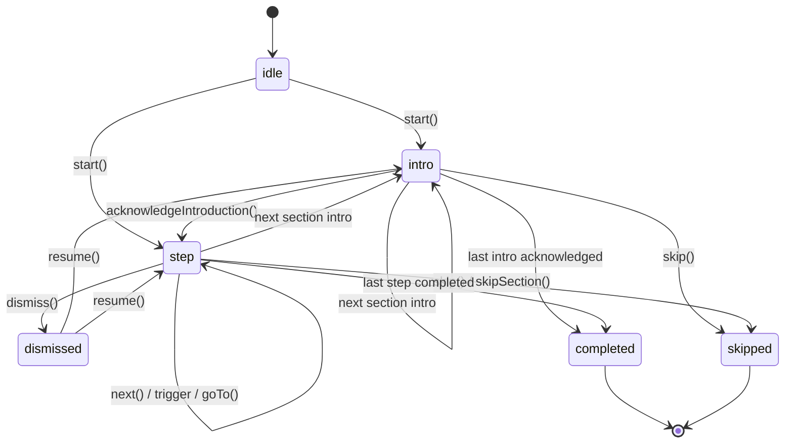

# Tour Engine Library

`@/features/tour` is the reusable guided-tour core for the GenAI Engine UI.
It owns the deterministic state machine, target resolution, route-aware step
entry, typed events, persistence hooks, and small React primitives. Product
tours own their copy, widgets, analytics labels, and any app-specific data
fetching.

Use `features/task-tour` as the complete product example. It keeps product
content and widgets outside the reusable core while validating the library
contracts in a real flow.

## Build A Tour In 10 Minutes

Create a typed config, create an engine, then render product-owned widgets
inside `TourHost`.

```tsx
import { useMemo } from "react";

import {
  BackdropBlocker,
  PopoverAnchor,
  Spotlight,
  TargetTracker,
  TourHost,
  TourProvider,
  applyBackdropAction,
  createTour,
  createTourStatePlugin,
  defineTourConfig,
  getHighlightPadding,
  useReactRouterNavigator,
  useTour,
} from "@/features/tour";

const config = defineTourConfig({
  id: "example-tour",
  sections: [
    {
      id: "welcome",
      introduction: {
        title: "Welcome",
        description: "Learn the workflow in a few steps.",
        primaryActionLabel: "Start",
      },
      steps: [],
    },
    {
      id: "workspace",
      title: "Workspace",
      steps: [
        {
          id: "open-panel",
          target: { kind: "selector", selector: '[data-tour-id="panel"]' },
          content: "Open the panel to continue.",
          placement: "right",
          advanceOn: [{ type: "click" }, { type: "action", name: "panel-opened" }],
          awaitTarget: { timeoutMs: 4000 },
        },
      ],
    },
  ],
});

function ExampleTour() {
  const navigator = useReactRouterNavigator();
  const statePlugin = useMemo(() => createTourStatePlugin({ storageKey: "example-tour" }), []);
  const engine = useMemo(() => createTour({ config, plugins: [statePlugin] }), [statePlugin]);

  return (
    <TourProvider tour={engine} navigator={navigator}>
      <TourHost>
        <ExampleIntro />
        <ExampleStep />
      </TourHost>
    </TourProvider>
  );
}

function ExampleIntro() {
  const { state, activeSection, actions } = useTour();
  if (state.status !== "intro" || !activeSection?.introduction) return null;

  return (
    <button type="button" onClick={() => void actions.acknowledgeIntroduction()}>
      {activeSection.introduction.primaryActionLabel ?? "Continue"}
    </button>
  );
}

function ExampleStep() {
  const { state, config, activeStep, actions } = useTour();
  if (state.status !== "step" || !activeStep) return null;

  const content =
    typeof activeStep.step.content === "function"
      ? activeStep.step.content({
          tourId: config.id,
          sectionId: state.sectionId,
          stepId: state.stepId,
          index: {
            sectionIndex: state.sectionIndex,
            stepIndex: state.stepIndex,
            globalStepIndex: state.globalStepIndex,
            totalSteps: state.totalSteps,
          },
          actions,
        })
      : activeStep.step.content;

  return (
    <TargetTracker>
      {({ rect }) => (
        <>
          <Spotlight rect={rect} highlight={activeStep.step.highlight} />
          {activeStep.step.overlay?.blockInteraction ? (
            <BackdropBlocker
              cutoutRect={rect}
              padding={getHighlightPadding(activeStep.step.highlight)}
              onBackdropClick={() => applyBackdropAction(activeStep.step.overlay?.onBackdropClick, actions)}
            />
          ) : null}
          <PopoverAnchor rect={rect} placement={activeStep.step.placement}>
            <div>
              {content}
              <button type="button" onClick={() => void actions.next()}>
                Next
              </button>
            </div>
          </PopoverAnchor>
        </>
      )}
    </TargetTracker>
  );
}
```

The library does not ship a default popover, intro dialog, or checklist.
Consumers compose those from `useTour`, `useTourEvent`, `useTourAction`,
`useTourPluginStore`, and the primitive rendering pieces.

## State Machine



Public transition actions return `Promise<void>`. Await them in tests and in
code that immediately depends on the next state.

## Config Reference

`TourConfig` contains stable `sections`. Section and step IDs should be unique
within a tour. Duplicate step IDs across sections can work because events carry
`tourId`, `sectionId`, and `stepId`, but unique IDs keep analytics and progress
keys easy to read.

```ts
const config = defineTourConfig({
  id: "my-tour",
  sections: [
    {
      id: "section-id",
      title: "Section title",
      introduction: { title: "Intro", description: "Optional copy" },
      skipable: true,
      route: "/tasks/:taskId/overview",
      steps: [
        {
          id: "step-id",
          target: { kind: "selector", selector: '[data-tour-id="target"]' },
          content: "Step content",
          placement: "bottom",
          highlight: { shape: "box", padding: 8, radius: 8 },
          overlay: { blockInteraction: true, onBackdropClick: "none" },
          route: { path: "/tasks/:taskId/traces", params: { taskId: "abc" } },
          prepare: { key: "traces.open-drawer" },
          skipWhen: async (ctx) => ctx.stepId === "optional-step",
          awaitTarget: { timeoutMs: 5000 },
          advanceOn: { type: "action", name: "target-opened" },
          fallback: { kind: "auto-complete", afterMs: 3000 },
        },
      ],
    },
  ],
});
```

Important invariants:

- `sections` may be empty. Starting an empty tour completes safely.
- `steps` may be empty. Intro-only sections use `steps: []` and advance with
  `acknowledgeIntroduction()`.
- `skipWhen` runs before target resolution. A true result emits `step:left`
  with cause `auto-skip` and does not emit `step:enter`.
- `fallback` is engine-owned behavior and currently supports only
  `{ kind: "auto-complete" }`. Static missing-target hints belong in widgets
  that listen to `target:lost`.
- `start({ resume: true })` only uses the engine `resumePosition` option when
  no explicit `position` is supplied. Persistence plugins expose
  `resumePosition(config)` so consumers can pass a concrete position.

## Targeting Guide

Choose the most stable target source available:

- `selector` uses `document.querySelector`. Prefer `data-tour-id` attributes
  for product-owned DOM.
- `ref` reads a React ref at step-enter time. Use this when the target is owned
  by the same component tree as the tour widget.
- `element` calls a plain resolver. Use for custom lookup logic that is not
  React-dependent.
- `queryHook` defers to a resolver registered with
  `useRegisterQueryHook(hookId, resolver)`. Use it for virtualized rows,
  portals, drawers, and third-party components where a `data-tour-id` may not
  reach the final DOM node.

The engine checks targets synchronously first. If the target is missing and
`awaitTarget.timeoutMs` is set, it waits with a `MutationObserver` until the
target appears or the timeout expires. Target events include `tourId`,
`sectionId`, and `stepId`; `useActiveTarget()` ignores events for inactive
steps.

## Preparation Callbacks

Preparation callbacks are plain async callbacks registered from React. They are
not React hooks and must not call hooks inside the callback body.

Safe pattern:

```tsx
function TracePrep({ taskId }: { taskId: string }) {
  const queryClient = useQueryClient();
  const drawerRef = useRef<HTMLElement | null>(null);
  const queryClientRef = useRef(queryClient);
  queryClientRef.current = queryClient;

  const prepareTrace = useCallback(async () => {
    await queryClientRef.current.ensureQueryData(["trace", taskId]);
    drawerRef.current?.scrollIntoView();
    return { ready: true };
  }, [taskId]);
  const resolveDrawer = useCallback(() => drawerRef.current, []);

  useRegisterPreparation("trace.open", prepareTrace);
  useRegisterQueryHook("trace.drawer", resolveDrawer);

  return <div ref={drawerRef} />;
}
```

The engine sequence is route navigation, preparation request, preparation
`{ ready: true }`, then target resolution. Keep app state in refs or stores
outside the callback and close over stable references with `useCallback`.

## Trigger Guide

Built-in `advanceOn` trigger types:

- `manual`: no automatic listener. The widget calls `actions.next()`.
- `click`: advances when the target, or an optional selector, is clicked.
- `visible`: advances when an `IntersectionObserver` threshold is met.
- `action`: advances when `useTourAction()(name)` or `engine.emitAction(name)`
  emits the matching name.
- `custom`: uses a trigger factory registered by a plugin.

Custom trigger plugin:

```ts
const hoverTriggerPlugin = {
  name: "hover-trigger",
  install: ({ registerTrigger }) => {
    registerTrigger("hover", ({ targetElement, advance }) => {
      if (!targetElement) return () => {};
      const onMouseEnter = () => advance("custom");
      targetElement.addEventListener("mouseenter", onMouseEnter);
      return () => targetElement.removeEventListener("mouseenter", onMouseEnter);
    });
  },
};
```

In development, a custom trigger without a registered factory warns instead of
silently doing nothing.

## Persistence And Resume

Use `createTourStatePlugin` for single-record persistence and progress:

```ts
const statePlugin = createTourStatePlugin({
  storageKey: "my-tour",
  getKey: (event) => `${event.sectionId}.${event.stepId}`,
  isStepComplete: (section, step, completed) => completed.has(`${section.id}.${step.id}`),
});

const engine = createTour({
  config,
  plugins: [statePlugin],
  resumePosition: statePlugin.resumePosition,
});
```

The plugin stores:

- `status`: `unseen`, `in-progress`, `dismissed`, `completed`, or `skipped`.
- `position`: the last intro or step position.
- `completed`: a set of completed progress keys.

Use `statePlugin.resumePosition(config)` to find the first incomplete section
or step. It returns `null` when all steps are complete. Intro-only sections are
recorded with the `${sectionId}.__intro` convention.

For resume UI, prefer:

```ts
const position = statePlugin.resumePosition(config);
if (position) {
  await actions.start({ position, resume: true });
}
```

Use `actions.resume()` only when the engine state is currently `dismissed`.

## Plugin Authoring

A plugin installs side effects through `TourPluginContext`:

```ts
import type { TourPlugin } from "@/features/tour";

export function createLoggingPlugin(): TourPlugin {
  return {
    name: "logging",
    install: ({ bus, registerLayer }) => {
      registerLayer("popover", 1300);
      const onStart = (event: { tourId: string }) => console.info("tour started", event.tourId);
      bus.on("tour:start", onStart);
      return () => bus.off("tour:start", onStart);
    },
  };
}
```

Use plugins for persistence, analytics, custom triggers, custom highlights,
layers, and shared query/preparation registries. Return a cleanup function for
subscriptions or DOM listeners.

Built-in plugins:

- `createTourStatePlugin` for persistence, progress, resume, reset, and
  cross-tab storage sync.
- `createAnalyticsPlugin` for forwarding selected engine events to a tracker.
- `createHighlightsPlugin` for registering custom highlight renderers.
- `createPreparationPlugin` for a plugin-owned preparation registry.

## Testing New Tours

Prefer focused Vitest coverage for authoring and engine contracts:

- Config builders should verify required sections, step IDs, action names,
  preparation keys, query-hook IDs, skip predicates, and route params.
- Widgets should render against a real `TourProvider` when possible and await
  async actions.
- Product bridges, such as legacy action dispatchers, should be tested as
  plain functions.
- Core changes require tests under `src/features/tour/**/__tests__`.

Useful commands:

```sh
GITLAB_UNIFY_FRONTEND_TOKEN=placeholder yarn test:run src/features/tour
GITLAB_UNIFY_FRONTEND_TOKEN=placeholder yarn test:run src/features/task-tour
GITLAB_UNIFY_FRONTEND_TOKEN=placeholder yarn type-check
GITLAB_UNIFY_FRONTEND_TOKEN=placeholder yarn lint
GITLAB_UNIFY_FRONTEND_TOKEN=placeholder yarn format:check
```

## Migration Notes From v0

- `tourEvents.ts` / `tourEventNames.ts` moved to the typed action channel:
  `useTourAction`, `engine.emitAction`, and optional product bridges such as
  `dispatchTourEvent`.
- `createPersistencePlugin` plus `createChecklistProgressPlugin` became
  `createTourStatePlugin`.
- Default UI components were removed. Consumers render widgets inside
  `<TourHost>`.
- `introductionPending` was replaced by the first-class `intro` state.
- Stub steps were removed. Use intro-only sections with `steps: []`.
- The old `event` trigger became `{ type: "action", name }`.
- Missing-target `show-hint` fallback moved out of the engine. Render hints in
  product widgets from `target:lost` instead.
